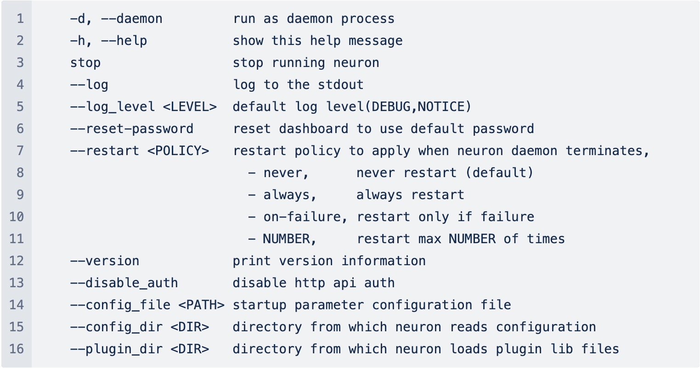

# Configuration Management
GridBeat supports modifying GridBeat's configuration parameters through `command line`, `environment variables`, and `configuration files`, which can provide a more flexible way of starting and running.
If `command line`, `environment variable`, and `configuration file` are configured at the same time, the priority relationship between the three is: command line > environment variable > configuration file

## Command Line



## Environment Variables

GridBeat supports reading environment variables during the startup process to configure startup parameters. The currently supported environment variables are as follows:


| Configuration name     | Configuration function                                                      |
| ---------------------- | --------------------------------------------------------------------------- |
| NEURON_DAEMON          | Set to 1, the GridBeat daemon runs; set to 0, GridBeat runs normally                             |
| NEURON_LOG             | Set to 1, GridBeat Log outputs to standard output stdout; set to 0, GridBeat Log does not output to standard output stdout; |
| NEURON_LOG_LEVEL       | GridBeat log output level, can be set to DEBUG or NOTICE                       |
| NEURON_RESTART         | GridBeat restart settings, which can be set to never, always, on-failure or NUMBER (1, 2, 3, 4)           |
| NEURON_DISABLE_AUTH    | Set to 1, GridBeat turns off Token authentication and authentication; set to 0, GridBeat turns on Token authentication and authentication              |
| NNEURON_CONFIG_DIR     | GridBeat configuration file directory                  |
| NEURON_PLUGIN_DIR      | GridBeat plug-in file directory                        |
| NEURON_SUB_FILTER_ERROR | Set to 1, the 'subscribe' attribute only detects the normal value read last time, and does not report any error codes to north apps|


## Configuration File

GridBeat provides YAML format configuration files to configure GridBeat-related personalized parameters. The configuration file path is the gridbeat installation directory config/gridbeat.yaml. The default configuration content is as follows:

```yaml
debug: true
log-path: ./log
data-path: ./data
extra-path: ./extra
mqtt:
    port: 1883
    host: localhost
http:
    port: 8080
    redirect_https: false
https:
    disable: false
    port: 8443
```
