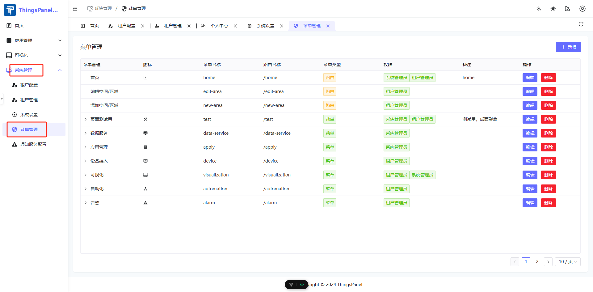

# Menus and Pages

## I. Overview
If the system-provided menus or pages do not meet your needs, you can develop your own pages and then create menus in the Permission Management page to link to your custom pages.

### Project Directory Structure
```
thinspanel
├── .vscode                        // vscode extensions and settings
│   ├── extensions.json            // vscode recommended extensions
│   ├── launch.json                // debug config (debug Vue and TS)
│   └── settings.json              // vscode settings (effective in this project, can be copied to user settings)
├── build                          // vite build related config and plugins
│   ├── config                     // build config
│   │   └── proxy.ts               // network proxy
│   └── plugins                    // build plugins
│       ├── index.ts               // plugins summary
│       ├── router.ts              // elegant-router plugin
│       ├── unocss.ts              // unocss plugin
│       └── unplugin.ts            // auto-import UI components, auto-parse iconify icons, auto-parse local svg
├── packages                       // sub-projects
│   ├── axios                      // network request wrapper
│   ├── color-palette              // color palette
│   ├── hooks                      // composable hooks
│   ├── materials                  // component materials
│   ├── ofetch                     // network request wrapper
│   ├── scripts                    // scripts
│   ├── uno-preset                 // uno-preset config
│   └── utils                      // utility functions
├── public                         // public directory (resources here will be in root after build)
│   └── favicon.svg                // website favicon
├── src
│   ├── assets                     // static assets
│   │   ├── imgs                   // images
│   │   └── svg-icon               // local svg icons
│   ├── components                 // global components
│   │   ├── advanced               // advanced components
│   │   ├── common                 // common components
│   │   └── custom                 // custom components
│   ├── constants                  // constants
│   │   ├── app.ts                 // app constants
│   │   ├── business.ts            // business constants
│   │   ├── common.ts              // common constants
│   │   └── reg.ts                 // regex constants
│   ├── enums                      // enums
│   ├── hooks                      // composable hooks
│   │   ├── business               // business hooks
│   │   │   ├── auth               // user auth
│   │   │   └── captcha            // captcha
│   │   └── common                 // common hooks
│   │       ├── echarts            // echarts
│   │       ├── form               // form
│   │       ├── icon               // icon
│   │       ├── router             // router
│   │       └── table              // table
│   ├── layouts                    // layout components
│   │   ├── base-layout            // base layout (global header, tabs, sidebar, footer)
│   │   ├── blank-layout           // blank layout (single page)
│   │   ├── context                // layout context state
│   │   ├── hooks                  // layout hooks
│   │   └── modules                // layout modules
│   │       ├── global-breadcrumb  // global breadcrumb
│   │       ├── global-content     // global content
│   │       ├── global-footer      // global footer
│   │       ├── global-header      // global header
│   │       ├── global-logo        // global logo
│   │       ├── global-menu        // global menu
│   │       ├── global-search      // global search
│   │       ├── global-sider       // global sidebar
│   │       ├── global-tab         // global tabs
│   │       └── theme-drawer       // theme drawer
│   ├── locales                // i18n config
│   │   ├── langs              // language files
│   │   ├── dayjs.ts           // dayjs i18n config
│   │   ├── locale.ts          // language file summary
│   │   └── naive.ts           // NaiveUI i18n config
│   ├── plugins                // plugins
│   │   ├── assets.ts          // static asset imports (css, scss, etc)
│   │   ├── dayjs.ts           // dayjs plugin
│   │   ├── iconify.ts         // iconify plugin
│   │   ├── loading.ts         // global loading plugin
│   │   └── nprogress.ts       // nprogress plugin
│   ├── router                 // vue router
│   │   ├── elegant            // elegant-router generated files
│   │   ├── guard              // router guards
│   │   ├── routes             // router declaration entry
│   │   │   ├── builtin        // built-in routes (root, 404)
│   │   │   └── index          // static router entry
│   │   └── index.ts           // router plugin entry
│   ├── service                // network requests
│   │   ├── api                // interface api
│   │   └── request            // encapsulated request functions
│   ├── store                  // pinia state management
│   │   ├── modules            // state modules
│   │   │   ├── app            // app state (reload, collapse, drawer)
│   │   │   ├── auth           // auth state (user info, rights)
│   │   │   ├── route          // route state (dynamic routes, menus, cached routes)
│   │   │   ├── tab            // tab state (tabs, scroll position)
│   │   │   └── theme          // theme state
│   │   └── plugins            // state mgmt plugins
│   ├── styles                 // global styles
│   │   ├── css                // css
│   │   └── scss               // scss
│   ├── theme                  // theme config
│   │   ├── settings.ts        // default & override settings
│   │   └── vars.ts            // theme token css variables
│   ├── typings                // TS type declarations (*.d.ts)
│   │   ├── api.d.ts           // api response types
│   │   ├── app.d.ts           // app related types
│   │   ├── common.d.ts        // common types
│   │   ├── components.d.ts    // auto-imported component types
│   │   ├── elegant-router.d.ts// elegant-router types
│   │   ├── env.d.ts           // env types
│   │   ├── global.d.ts        // global types
│   │   ├── naive-ui.d.ts      // NaiveUI types
│   │   ├── router.d.ts        // Vue router types
│   │   ├── storage.d.ts       // storage types
│   │   └── union-key.d.ts     // union key types
│   ├── utils                  // global utility functions (pure, no state)
│   │   ├── common             // common utils
│   │   ├── icon               // icon utils
│   │   ├── service            // service utils
│   │   └── storage            // storage utils
│   ├── views                  // pages
│   │   ├── _builtin           // built-in pages: login, exception
│   │   ├── about              // about
│   │   ├── function           // function
│   │   ├── home               // home
│   │   ├── manage             // system management
│   │   ├── multi-menu         // multi-level menu
│   │   └── user-center        // user center
│   ├── App.vue                // Vue entry
│   └── main.ts                // TS entry
├── .editorconfig              // editor config
├── .env                       // env file
├── .env.prod                  // production env
├── .env.test                  // test env
├── .gitattributes             // git attributes
├── .gitignore                 // git ignore
├── .npmrc                     // npm config
├── CHANGELOG.md               // changelog
├── eslint.config.js           // eslint flat config
├── index.html                 // html file
├── package.json               // npm package file
├── pnpm-lock.yaml             // pnpm lock file
├── README.md                  // readme
├── README.zh-CN.md            // readme (chinese)
├── tsconfig.json              // TS config
├── uno.config.ts              // unocss config
└── vite.config.ts             // vite config
```

## II. Development Steps

### 1. Start Project & Configure Environment Variables

Install dependencies:
```
pnpm i 
```

Start Project:
```
pnpm dev
```

Modify `devURL` in `env.config.ts` to your backend address. Clone the backend from [ThingsPanel Backend](https://github.com/ThingsPanel/thingspanel-backend-community) or use Docker deployment.
```
  const devURL = '';
```

Configure Environment Variables:
`.env`, `.env.development`, `.env.production` correspond to global, development, and production variables respectively. Menus are fetched from the backend only when `VITE_AUTH_ROUTE_MODE=dynamic`.

```
VITE_BASE_URL=/
VITE_APP_TITLE=ThingsPanel IoT Cloud Platform
VITE_APP_DESC=ThingsPanel
# the prefix of the icon name
VITE_ICON_PREFIX=icon
# the prefix of the local svg icon component, must include VITE_ICON_PREFIX
# format {VITE_ICON_PREFIX}-{local icon name}
VITE_ICON_LOCAL_PREFIX=icon-local
# auth route mode: static ｜ dynamic
VITE_AUTH_ROUTE_MODE=static
# VITE_AUTH_ROUTE_MODE=dynamic
# static auth route home
VITE_ROUTE_HOME=home
# default menu icon
VITE_MENU_ICON=mdi:menu
# encrypt password
VITE_ENCRYPT_PASSWORD=0
```

### 2. Write Vue Page

Open the frontend project in your IDE. Create a new folder in `src/view`. Name it as you wish, for example, `test123`.


Create a new Vue page named `index.vue` inside the `test123` directory. When running `pnpm dev`, the page route will be automatically added to `src\router\elegant\routes.ts` mentioned above. Key info: `i18nKey`, `path`, `component`, `title`. You will need these when configuring the menu.

`index.vue` code:
```html
<template>
  <div>
    <h1 style="color:white">This is a test page</h1>
    <h2 style="color:green">This is a test page</h2>
  </div>
</template>

<script>
export default {
  name: "index"
}
</script>

<style scoped>

</style>
```

Route (auto-generated):
```javascript
{
    name: 'test123',
    path: '/test123',
    component: 'layout.base$view.test123',
    meta: {
      title: 'test123',
      i18nKey: 'route.test123'
    }
  },
```

After writing the page, you can add the menu.

### 3. Add Menu

Start the project, log in as **Administrator**, and ensure `VITE_AUTH_ROUTE_MODE=dynamic` is set in environment variables.
Go to **System Management** -> **Menu Management** on the left menu to open the permission management page.


:::tip
Note: Only Super Admins have permission to view or edit the permission management page. Be sure to backup the database before modification.
You must configure the I18n for the corresponding key in the language files.

:::

1. Click `+ Add` in Menu Management.
2. Select Parent Menu.
3. Enter Title.
4. Enter `i18nKey: 'route.test123'` from the route.
5. Enter `name: 'test123'`.
6. Enter `path: '/test123'`.
7. Select an icon.
8. Set Sort Order.
9. Select Type.
10. Select Permissions.
11. Enter Description.
12. Confirm Add.


Refresh the page, and you should see the page appear in the menu list.


