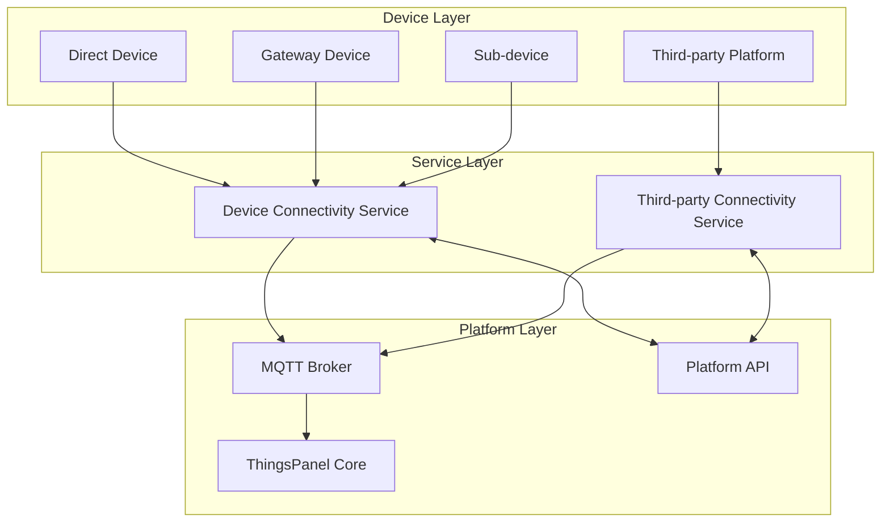
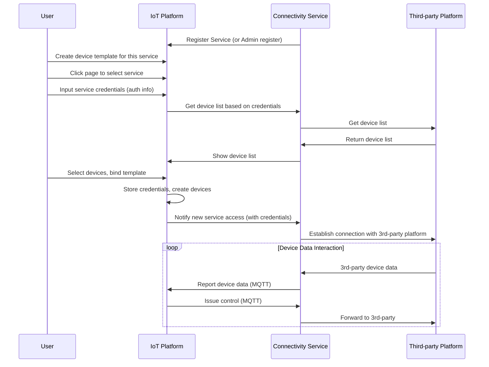
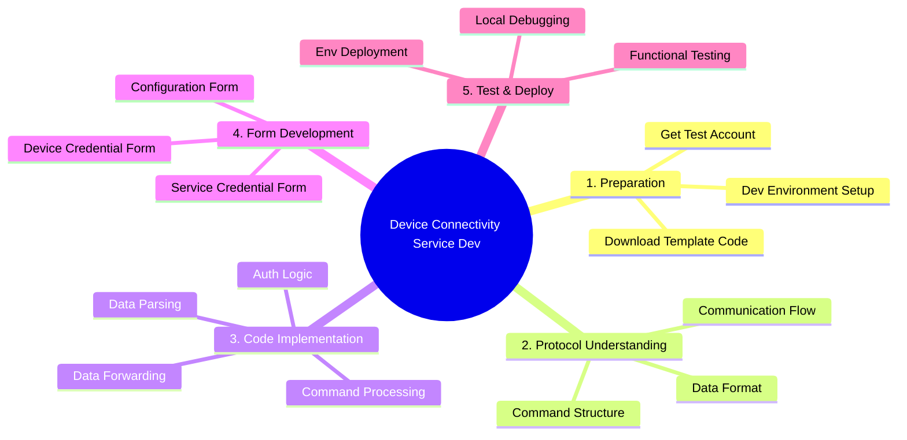

# Device Connectivity Service Dev Guide

## Overview

### Background & Issues

In the IoT field, communication protocols are extremely diverse and complex. Common protocols include MQTT, TCP, HTTP, SOAP, Modbus, OPC-UA, Bacnet, KNX, LwM2M, SNMP, etc., along with countless other protocols and various gateway or third-party services.

:::warning Status Quo & Challenges
- **Complexity**: These protocols and services differ in communication patterns and message specifications, leading to huge complexity in system integration.
- **Consequences**: This complexity makes the system bloated and inefficient, and also difficult to extend and maintain, resulting in high maintenance costs.
:::

### Service Definition

The Device Connectivity Service is a multifunctional middleware component that acts as a bridge between devices and the system, connecting devices to the ThingsPanel platform and enabling interaction between devices and the platform.

### Service Categories

:::info Two Core Categories
1. **Device Connectivity Service**: Supports various IoT protocols (e.g., MODBUS, MQTT), enabling ThingsPanel to communicate **directly** with devices using these protocols.
2. **Third-party Connectivity Service**: Connects ThingsPanel with various third-party IoT platforms, communicating with devices **indirectly** to achieve data interoperability and device management.
:::

### Key Features

- 🔗 Provides unified interface specifications, simplifying access for devices and third-party platforms.
- 🌐 Supports multiple protocols and services, enhancing ThingsPanel's compatibility and extensibility.
- ⚙️ Enables flexible configuration and credential management, facilitating quick access to different protocols and third-party platforms.
- 📊 Real-time data synchronization and device status monitoring.
- 🔧 Modular design, easy to extend to support new protocols and third-party platforms.

### Interaction Structure Diagram


### Architecture Diagram



## Device Connectivity Service Interaction Flow



## Development Guide

### Preparation



### Development Steps

#### 1. Download Service Template

```bash
git clone https://gitee.com/ThingsPanel/protocol-plugin-template.git
```

#### 2. Understand Core Concepts

:::info Four Core Data Types
Understanding ThingsPanel's four data models is crucial for plugin development:

- **🔄 Telemetry** - Real-time data reported by devices, usually measurements changing over time.
- **📋 Attributes** - Static or less frequently changing characteristics of devices.
- **🎯 Events** - Specific events or state changes occurring in devices.
- **⚡ Commands** - Control instructions sent from the platform to devices.
:::

#### 3. Modify Template Code

- Read `README-DEV.md` in the template source.
- Update SDK to latest version:
  ```bash
  go get -u github.com/ThingsPanel/tp-protocol-sdk-go@latest
  ```
- Modify credential form `from_voucher.json` based on protocol docs.
- Determine if configuration form is needed.
- Modify interface implementation in `http_service/service.go`.

#### 4. Register Device Connectivity Service

Register the service on the platform using a Super Admin account:
- **App Management** → **Connectivity Service Management** → **Add New Service**

#### 5. Write Core Logic

- Handle upstream/downstream device messages.
- Use AI tools to assist in generating protocol parsing code.
- Interact with the platform via MQTT client.

#### 6. Integration Testing

- Create device template and select protocol.
- Create device and bind template.
- Fill in device credential info.
- Connect device to the service and test.

## Technical Specifications

Reference API Docs: [ThingsPanel API Docs](https://docs.thingspanel.io/en/developer-guide/api-reference/index.html)

Table of Contents:
- ✨ Device Connectivity Service - Platform Provided
- ✨ Device Connectivity Service - Service Provided

## Data Interaction Specifications

### Service Pushes Data to Platform

#### Direct Device / Sub-device / Gateway Device Messages

- **MQTT User**: plugin
- **Publish Topic**: `device/telemetry`
- **MESSAGE Format**:
  ```json
  {"device_id":"device_id","values":{"key":"value"}}
  ```

#### Online/Offline Notification

- **Publish Topic**: `devices/status/{device_id}`
- **Payload**:
  0 - Device Offline
  1 - Device Online

### Platform Pushes Data to Service

#### Subscribe Topic Spec

The service needs to subscribe to topics with a prefix:

- **Subscribe Topic**: `plugin/{service_identifier}/#`
- **Explanation**: `plugin/{service_identifier}/` is the prefix filled in during registration. The `#` part follows the [MQTT Device Onboarding Rules](../../device-connectivity/mqtt-device-rule.md).

:::note Topic Mapping
The service's subscription topic adds a prefix compared to the platform downstream spec. Also `device_number` should be changed to `device_id`.
:::

## Service Registration

### Registration Parameters

| Parameter | Description |
|------|------|
| Service Name | Displayed in protocol dropdown when creating device template |
| Service Identifier | Unique ID in the system, alphanumeric |
| Category | Select access protocol |
| HTTP Service Address | Address for platform backend to access service API, e.g., 127.0.0.1:8151 |
| Service Sub Prefix | Format like `service/{name}/` |
| Device Onboarding Address | Displayed under device credential management, prompt for user device connection address |

### Registration Method

#### Platform Registration

1. Login as Super Admin.
2. Go to **Integration Management** → **Connectivity Service Management**.
3. Click **Add New Service**.
4. Fill in configuration info.

## Resources

:::tip Dev Resources
- [MQTT Gateway Access Rules](../../device-connectivity/mqtt-gateway-rule.md)
- [MQTT Direct Device Onboarding Rules](../../device-connectivity/mqtt-device-rule.md)
- [Modbus Service Example](https://github.com/ThingsPanel/modbus-protocol-plugin)
- [GB26875.3-2011 Service Example](https://gitee.com/ThingsPanel/protocol-plugin-pressure-transmitter)
:::

## Best Practices

:::warning Dev Notes
1. **Message ID Management**: Recommend using last 7 digits of timestamp to ensure uniqueness in short term.
2. **Device Uniqueness**: Ensure device ID is globally unique in the system.
3. **Error Handling**: Implement complete error response mechanism for diagnosis.
4. **Performance**: Recommend parsing data within the service to avoid script conversion.
5. **Form Validation**: Validate JSON format before reporting.
6. **Device State Management**: Implement state management including online/offline.
:::
