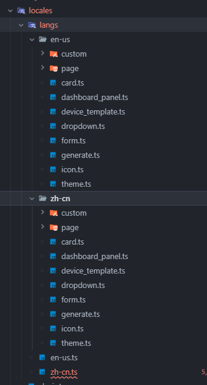

# Internationalization

## I. Overview
Through ThingsPanel's support for internationalization (i18n), you can easily translate the ThingsPanel platform.
Currently, two languages are supported: Chinese and English. If these two languages do not meet your needs, you can customize other languages.


## II. Development Steps

### 1. Create New Language File
Language files are located in the `src\locales` folder.



`ch.js` is the Chinese language file, `en.js` is the English language file. Please customize for other languages.
The format of the language file is as follows:
```typescript
const local: App.I18n.Schema = {
  custom,
  default: '',
  title: 'ThingsPanel',
  system: {
    title: 'System Name: {name}',
    screen: 'Visualization Dashboard'
  }
  
  }
```
:::tip
All keys should be uppercase, with multiple words separated by underscores.
Use TEXT1, TEXT2... for long text.
Keys for reused components can be placed in COMMON.
:::

### 2. Use Language File
If you only translate Chinese and English, you can skip this section.
Open the `src\locales\locale.ts` file and add your defined language to `languages`.

```typescript
import zhCN from './langs/zh-cn'
import enUS from './langs/en-us'

const locales: Record<App.I18n.LangType, App.I18n.Schema> = {
  'zh-CN': zhCN,
  'en-US': enUS
}

export default locales
```
Where `lang` is the filename, `name` is the language name displayed in the dropdown list in the project, and `flag` is the language icon.
Then you can translate text on the page.

### 3. Translate Pages
- Template
```  
Format: {{ $t(NAME)}}  ```
  Example:
```html
<!-- Slot Method -->
<span class="font-weight-bolder text-dark">
  {{ $t("HOME.QUICK_GUIDE") }}
</span>
```

```html
<!-- Prop Method -->
<el-table-column :label="$t('COMMON.NO')" type="index" width="260"></el-table-column>
```
  

- JS
  Format: `this.$t(NAME);`
  Example:
```javascript
// vue 2.0
this.$t("PLUGIN.DEVICE_INFO");

// vue 3.0
const self = getCurrentInstance().proxy;
self.$t("PLUGIN.DEVICE_INFO");
```
