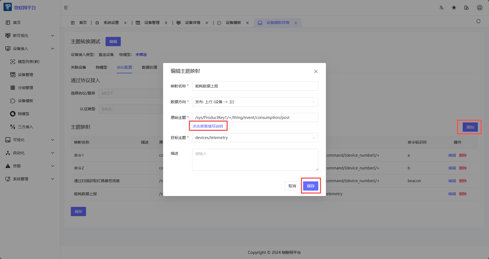
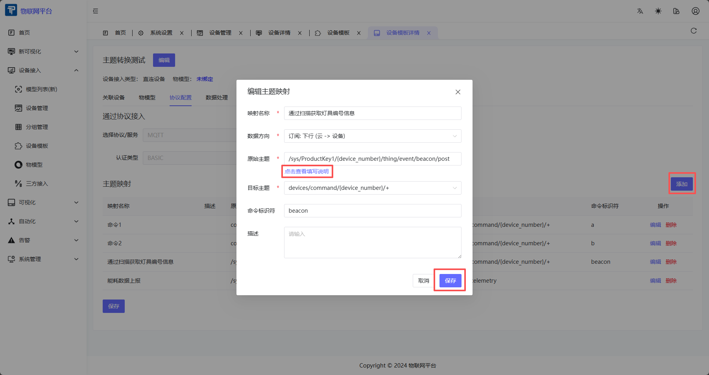

# Custom Topic & Message

## I. Overview

Topic transformation is used to map device custom MQTT topics to platform standard topics, enabling non-intrusive access for devices from different vendors.

**Core Concepts:**
- **Original Topic**: The actual topic published/subscribed by the device.
- **Target Topic**: The platform's standardized topic.
- **Data Direction**:
  - **Uplink**: Device → Platform
  - **Downlink**: Platform → Device

**Function Combination:**
Topic transformation can be combined with **Data Processing** functions to perform format conversion and field mapping on uplink/downlink messages, solving access issues for devices with non-standard messages.

---

## II. Uplink Topic Transformation

### Definition

The actual MQTT topic published by the device. Supports using `+` as a path placeholder to match variable parts. Does not support `#`. Optional variables can be used to distinguish messages.

### Basic Example

**Device Publishes:** `123456789/up/devices`

**Mapping Configuration:**
- Original Topic: `+/up/devices`
- Target Topic: `devices/telemetry`

**Result:** Messages published by the device to `123456789/up/devices` will be automatically forwarded to the platform standard topic `devices/telemetry`.

### About message_id

- **Auto Generation**: If the target topic is configured as `devices/attributes/{message_id}`, the device does not need to carry `message_id` when publishing; the system will generate it automatically.
- **Response Tracking**: The response topic will carry `message_id` for the device to identify the corresponding response content.

---

## III. Downlink Topic Transformation

### Definition

The actual MQTT topic subscribed by the device. Supports dynamic variables. The target topic can end with `+` to match `message_id`.

### Basic Example

**Device Subscribes:** `123456789/down`

**Mapping Configuration:**
- Original Topic: `{device_number}/down`
- Target Topic: `devices/telemetry/control/{device_number}`

**Result:** Messages published by the platform to `devices/telemetry/control/123456789` will be automatically forwarded to the topic `123456789/down` subscribed by the device.

### Multi-Mapping Scenario

When a device supports multiple command types, `data_identifier` is used to identify and route them.

**Configuration Example:**

```
Mapping 1: devices/command/{device_number}/+ → wled/{device_number}/cmd (data_identifier = "wled")
Mapping 2: devices/command/{device_number}/+ → default/{device_number}/cmd (data_identifier = "default")
```

**Message Processing Flow:**

1. Web sends: `{"method": "wled", "params": {"delay": 3}}` to `devices/command/{device_number}/+`
2. System matches `method="wled"` → Hits Mapping 1
3. Device receives: `{"delay": 3}` at `wled/{device_number}/cmd` (only `params` part is forwarded)

**Fallback Rule:**

- If none of the configured `data_identifier` matches, the configuration with empty `data_identifier` (first one found) is used for forwarding (payload remains unchanged).

---

## IV. Data Processing Function

### Definition

The data processing function is used to pre-process uplink/downlink messages, including format conversion, field mapping, and data cleaning, to resolve inconsistencies between device message formats and platform standards.

### Use Cases

**Scenario 1: Non-JSON Format to JSON Format**

Some devices report data in custom format or CSV format, which needs to be converted to platform standard JSON format.

1. **Device Report Format** (Custom separator): `temp:25.5|hum:60|press:1013.25`
2. **Platform Standard Format**: `{"temperature": 25.5, "humidity": 60, "pressure": 1013.25}`
3. **Solution**:
   - Configure Topic Transformation: Map device topic `device/{device_number}/data` to platform standard topic `devices/telemetry`
   - Configure Data Processing: Use "Uplink Data Pre-processing" to parse custom format and convert to standard JSON structure.

**Scenario 2: Nested JSON Structure to Flat JSON Structure**

Some devices report data in nested structure, which needs to be flattened.

1. **Device Report Format** (Nested):
   ```json
   {
     "sensor": {
       "temperature": 25.5,
       "humidity": 60
     },
     "timestamp": 1699123456
   }
   ```
2. **Platform Standard Format** (Flat):
   ```json
   {
     "temperature": 25.5,
     "humidity": 60,
     "timestamp": 1699123456
   }
   ```
3. **Solution**:
   - Configure Topic Transformation: Map device topic to platform standard topic.
   - Configure Data Processing: Use "Uplink Data Pre-processing" to flatten the nested structure.

**Processing Flow:**

```
Device Publish → Topic Transformation → Data Processing → Platform Standard Topic
```

---

## V. Operation Steps

### 5.1 Enter Protocol Configuration Page


1. Enter Device Template Detail Page.
2. Click "Protocol Configuration" tab.
3. Select Protocol Type as "MQTT".

### 5.2 Add Uplink Topic Mapping



1. Click "Add" button.
2. Fill mapping info:
   - **Mapping Name**: Rule name (Required).
   - **Data Direction**: Select "Publish: Uplink (Device → Cloud)".
   - **Original Topic**: Actual topic published by device, supports `+` placeholder.
   - **Target Topic**: Platform standard topic (Dropdown selection).
   - **Description**: Optional.
3. Click "Save".

### 5.3 Add Downlink Topic Mapping



1. Click "Add" button.
2. Fill mapping info:
   - **Mapping Name**: Rule name (Required).
   - **Data Direction**: Select "Subscribe: Downlink (Cloud → Device)".
   - **Original Topic**: Actual topic subscribed by device, must contain `{device_number}`.
   - **Target Topic**: Platform standard topic (Dropdown selection).
   - **Command Identifier** (Optional): Used for multi-mapping scenarios, matching `method` field in payload.
   - **Description**: Optional.
3. Click "Save".

### 5.4 Edit and Delete Mapping

- Click "Edit" to modify mapping config.
- Click "Delete" to remove mapping rule.
- Click "Save" at bottom of page to apply changes.

### 5.5 Configure Data Processing


1. In Device Template Detail Page, click "Data Processing" tab.
2. Click "Add Data Processing" button.
3. Select Processing Type:
   - **Uplink Data Pre-processing**: Process telemetry data reported by device.
   - **Downlink Data Pre-processing**: Process control data sent by platform.
   - **Attribute Uplink/Downlink Pre-processing**: Process attribute related data.
   - **Command Downlink Pre-processing**: Process command downlink data.
   - **Event Uplink Pre-processing**: Process event uplink data.
4. Configure data processing rules (e.g., field mapping, format conversion).
5. Save configuration.

**Processing Order:**
- Topic Transformation executes first, forwarding message to standard topic.
- Data Processing executes next, converting message content format.

---

## VI. Notes

1. **Placeholder Rules**:
   - Supports `+` (Single level match), does NOT support `#` (Multi-level match).
   - Downlink original topic MUST contain `{device_number}` variable.

2. **Priority**:
   - Mappings match in order of priority (small to large).
   - Smaller priority means earlier matching.

3. **Multi-mapping Matching**:
   - For downlink topic transformation, configurations with non-empty `data_identifier` are matched first.
   - On successful match, payload is simplified to `params` part.
   - On no match, fallback to configuration with empty `data_identifier` (payload remains unchanged).

4. **Cache Mechanism**:
   - Mapping config changes automatically clear cache.
   - If config doesn't take effect, wait for cache refresh or restart service.

5. **Topic Transformation vs Data Processing**:
   - Topic Transformation handles topic mapping.
   - Data Processing handles message content conversion.
   - Can be used together for complete non-standard device access.

---

## VII. Common Questions

**Q: Why is the message published by the device not forwarded?**

A: Check:
- Is Original Topic pattern correctly matching actual device topic?
- Is device associated with the correct device template?

**Q: Why is the payload of downlink message modified?**

A: When `data_identifier` matches successfully, system automatically simplifies payload to `params` part. To keep it unchanged, use a fallback configuration with empty `data_identifier`.

**Q: How to test if topic mapping is working?**

A: Use MQTT client tool:
- Uplink: Simulate device publishing to original topic, observe if platform standard topic receives message.
- Downlink: Publish to standard topic on platform, observe if device subscribed to original topic receives message.

**Q: What is the difference between Topic Transformation and Data Processing?**

A:
- **Topic Transformation**: Solves topic name inconsistency, maps device custom topic to platform standard topic.
- **Data Processing**: Solves message format inconsistency, converts message content, maps fields, etc.
- Both used together solve complete access requirements for non-standard devices.
