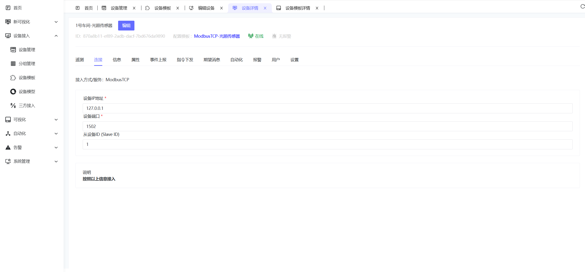

# Modbus TCP Direct

## 1. Functional Overview

ThingsPanel's Modbus TCP access service supports direct connection to industrial devices, automatically collecting data and reporting to the platform. Key features:

- **Visual Configuration**: Web interface to configure device parameters and data address tables.
- **Smart Polling**: Flexible data collection strategies and cycle configuration.
- **Device Control**: Supports writing to coils and registers for control.
- **Connection Management**: Automatic reconnection, connection pool management, status monitoring.

## 2. Quick Start

Prerequisite: Modbus TCP connectivity service is deployed and registered to the platform.

### 2.1 Prepare Device Information

Collect the following device information before configuration:

| Parameter | Description | Example |
|------|------|------|
| IP Address | Device IP Address | 192.168.1.100 |
| Port | Modbus TCP Port | 502 |
| Slave ID | Device SlaveID | 1 |
| Data Address | Register Address Range | 40001-40010 |

### 2.2 Create Device Template


1. Go to **Device Connectivity** - **Device Templates**.
2. Select Access Type: Direct Device.
3. Select Modbus TCP (Direct), set Authentication Type to None.
4. Fill in Collection Interval, enable Address Merge Optimization if needed.
5. Configure Collection Parameters as follows:

| Config Data | Description | Example |
|--------|------|------|
| Data Point Name | Unique Identifier | temperature |
| Function Code | Modbus Function Code | 03 (Read Holding Registers) |
| Start Address | Register Address | 40001 |
| Data Type | Data Parsing Type | Float32 |
| Endianness | Big/Little Endian | Big Endian |
| Scaling Factor | Optional, Value Scaling | 0.1 |
| Unit | Optional | °C |

### 2.3 Create Device

 

1. Go to **Device Connectivity** - **Device Management** → **Add Device**.
2. Fill in device name, select device type: The device template created in the previous step.
3. Enter Device Details, select the Connection tab, fill in Device IP, Port, Slave ID, and Save.

```
Device IP: 192.168.1.100
Port: 502
Slave ID: 1
```

## 3. Data Address Table Configuration

### 3.1 Add Data Points

Click **Data Address Table** → **Add Data Point** to configure parameters:

| Config Item | Description | Example |
|--------|------|------|
| Data Point Name | Unique Identifier | temperature |
| Function Code | Modbus Function Code | 03 (Read Holding Register) |
| Start Address | Register Address | 40001 |
| Data Length | Register Quantity | 2 |
| Data Type | Data Parsing Type | Float32 |
| Endianness | Big/Little Endian | Big Endian |
| Scaling Factor | Value Scaling | 0.1 |

### 3.2 Supported Function Codes

| Function Code | Description | Address Range |
|--------|------|----------|
| 01/05 | Read/Write Coil Status | 00001-09999 |
| 02 | Read Discrete Input | 10001-19999 |
| 03/06 | Read/Write Holding Register | 40001-49999 |
| 04 | Read Input Register | 30001-39999 |

### 3.3 Data Types

| Type | Registers Occupied | Description |
|------|------------|------|
| Bool | 1 | Boolean |
| Int16 | 1 | 16-bit Signed Integer |
| UInt16 | 1 | 16-bit Unsigned Integer |
| Int32 | 2 | 32-bit Signed Integer |
| UInt32 | 2 | 32-bit Unsigned Integer |
| Float32 | 2 | 32-bit Float |
| Float64 | 4 | 64-bit Float |

## 4. Device Control

### 4.1 Supported Control Types

- **Coil Control**: Function Code 05 (Single Coil)
- **Register Control**: Function Code 06 (Single Register), 16 (Multiple Registers)

### 4.2 Control Operations

Real-time control can be performed from the platform by sending control commands using the configured data point names:

```json
{
  "temperature": 15.2,
  "switch": 1,
  "speed": 1200
}
```

Explanation:
- `temperature`: Set target temperature value
- `switch`: Control switch state (0=OFF, 1=ON)

## 5. Troubleshooting

### 5.1 Common Issues

| Issue | Possible Cause | Solution |
|------|----------|----------|
| Device Disconnected | Network unreachable, IP error | Check network, confirm device IP |
| Read Fail | Address error, unsupported function code | Check register address and function code |
| Data Abnormal | Data type error, endianness error | Confirm data type and endianness |
| Control Fail | Device read-only, permission denied | Check write permission and function code support |

### 5.2 Debugging Suggestions

1. **Step-by-step**: Configure a few data points first, then add more.
2. **Tools**: Use Modbus tools to verify communication.
3. **Logs**: Check system logs for detailed errors.
4. **Network**: Use ping to test connectivity.

## 6. Performance Optimization

### 6.1 Address Merge Optimization

Enable address merge optimization to improve efficiency:
- **Continuous Addresses**: System automatically merges continuous register addresses.
- **Reduce Requests**: Reduces Modbus request count, improving response speed.
- **Suggestion**: Configure related data points in continuous address ranges.

### 6.2 Collection Cycle Setting

Set appropriate collection cycles:
- **High Frequency**: Important parameters (1-5s).
- **Normal**: General parameters (10-30s).
- **Status**: Slowly changing parameters (60s+).

## References

[ThingsPanel Modbus TCP Direct Access [Video]](https://www.bilibili.com/video/BV1gJnAzfEk2/?spm_id_from=333.1387.homepage.video_card.click)