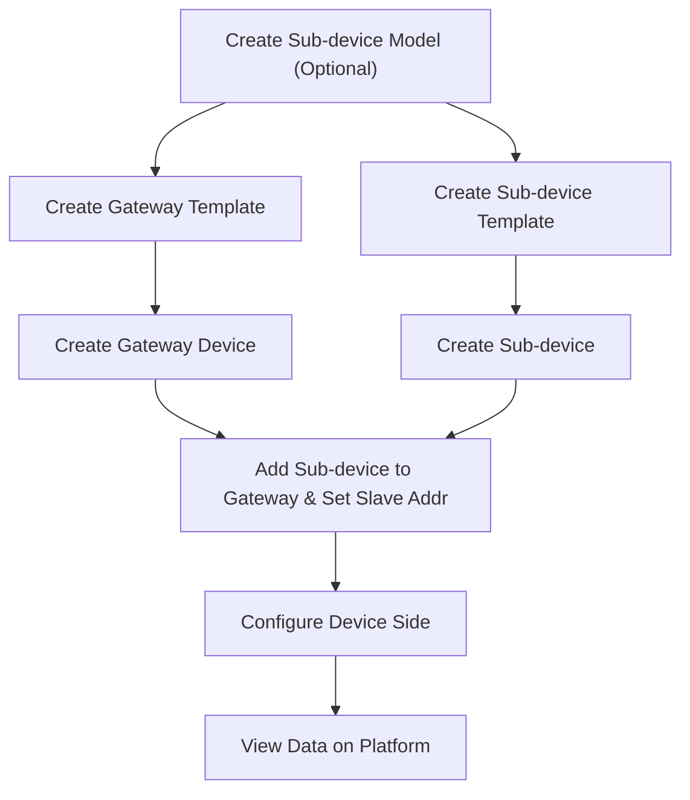

# Modbus RTU

## Prerequisites

Install Modbus Device Connectivity Service and register the service as System Admin.

[ThingsPanel 1.0.0 Modbus Service Installation Guide](https://github.com/ThingsPanel/modbus-protocol-plugin)

## Operation Flowchart

## Onboarding Steps

### Create Modbus Gateway Device on Platform

1. Create Gateway Device Template
   1. Create Device Template. 
   2. In Protocol Configuration, select Modbus_RTU or Modbus_TCP. 
2. Create Device, bind the Gateway Template created above.
   1. Go to `Device Connectivity` -> `Device Management`, click `Add Device` to create gateway device. 
   2. Fill in Registration Packet info (Ensure consistency with Gateway or DTU config, and disable device heartbeat packet). 
   3. Power on the device, you should see it online.

### Create Sub-device for Modbus Gateway

1. Create Sub-device Template
   1. Create Device Template. 
   2. In Protocol Configuration, select Modbus_RTU or Modbus_TCP. A config form will appear. Fill in config info as prompted. 
2. Create Device, bind the Sub-device Template.
   1. Go to `Device Connectivity` -> `Device Management`, click `Add Device` to create sub-device. 
   2. Set Heartbeat Time. 
3. Bind Sub-device to Gateway
   1. Go to `Device Connectivity` -> `Device Management`, select the corresponding Gateway Device, choose Sub-device tab, click Add Sub-device, select the sub-device to add. 
   2. Modify Sub-device Address (Slave Address). 
   3. View Sub-device details. If configured correctly, the sub-device should report data normally.

## Onboarding Result

## References

[Connecting Smart Meter via USR-DR154 Gateway to ThingsPanel](http://thingspanel.cn/posts/54)
