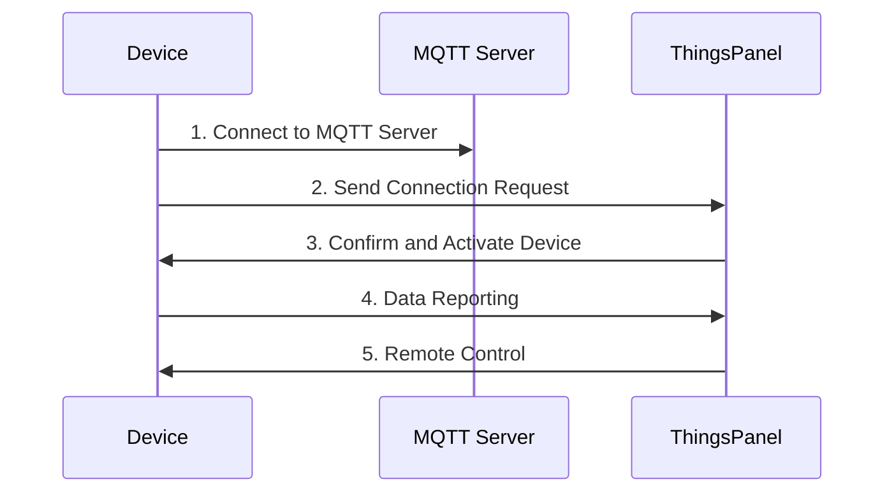

# Gateway Device MQTT Interaction Spec

## Overview

This specification describes the requirements for connecting gateway devices to ThingsPanel via MQTT protocol, defining the data interaction format and flow.

:::info Important
- **message_id**: Message identifier. No duplication recently. Suggest last 7 digits of timestamp (millis).
- **device_number**: Device ID. Unique identifier.
- **sub_device_address**: Sub-device address. Unique under the gateway.
- Core interaction data: **Telemetry, Attributes, Events, Commands**.
:::

:::note Flexibility
- **Subscribe/Publish**: Optional based on needs.
- **Response Mechanism**: Optional based on business scenario.
- **Message Format**: Non-standard formats supported via script conversion on platform.
:::

## Device Requirements

- ✅ MQTT Client Capability
- ✅ Internet connection and stable operation

## Access Steps



1. **Register Device**: Create device in ThingsPanel and get config.
2. **Establish Connection**: Key device connects to MQTT server.
3. **Send Request**: Device sends connection request.
4. **Activate**: ThingsPanel activates device.
5. **Data Interaction**: Report data, receive control.

## MQTT Topic Specification

### Device Publish Topics

| Topic | Description | Data Type | Required |
|------|------|----------|----------|
| `gateway/telemetry` | Report telemetry | Telemetry | Optional |
| `gateway/attributes/{message_id}` | Report attributes | Attribute | Optional |
| `gateway/event/{message_id}` | Report events | Event | Optional |
| `gateway/command/response/{message_id}` | Command response | Response | Optional |
| `gateway/attributes/set/response/{message_id}` | Attribute set response | Response | Optional |

### Device Subscribe Topics

:::note
`+` is `message_id` placeholder.
:::

| Topic | Description | Data Type | Required |
|------|------|----------|----------|
| `gateway/telemetry/control/{device_number}` | Receive control | Control | Optional |
| `gateway/attributes/set/{device_number}/+` | Receive attribute set | Attribute Set | Optional |
| `gateway/attributes/get/{device_number}` | Receive attribute get | Attribute Get | Optional |
| `gateway/command/{device_number}/+` | Receive command | Command | Optional |
| `gateway/attributes/response/{device_number}/+` | Receive attribute ack | Response Ack | Optional |
| `gateway/event/response/{device_number}/+` | Receive event ack | Response Ack | Optional |

## Data Interaction Format

### 1. Telemetry Reporting

**Topic:** `gateway/telemetry`

#### Real-time Mode

```json title="Single Layer Gateway"
{
    "gateway_data": {
        "temperature": 25.5,
        "version": "1.0.0",
        "switch": true
    },
    "sub_device_data": {
        "sensor_001": {
            "temperature": 24.0,
            "humidity": 65.0,
            "switch": true
        },
        "sensor_002": {
            "temperature": 26.5,
            "humidity": 60.0,
            "switch": false
        }
    }
}
```

```json title="Multi-Level Gateway"
{
  "gateway_data": { 
    "temperature": 26.0, 
    "version": "2.0.0", 
    "switch": true 
  },
  "sub_device_data": {
    "device_001": { 
      "temperature": 25.0, 
      "humidity": 70.0 
    }
  },
  "sub_gateway_data": {
    "gateway_001": {
      "gateway_data": { 
        "temperature": 28.0, 
        "version": "1.5.0", 
        "switch": true 
      },
      "sub_device_data": {
        "sensor_101": { 
          "temperature": 27.5, 
          "humidity": 55.0 
        }
      }
    }
  }
}
```

#### Historical Mode

Array of time-series data.

```json title="Historical (Single Gateway)"
{   
    "gateway_data": [
        {"ts": 1609459200, "values": {"temperature": 25.0, "humidity": 60.0}},
        {"ts": 1609462800, "values": {"temperature": 26.0, "humidity": 62.0}}
    ],
    "sub_device_data": {
        "sensor_001": [
            {"ts": 1609459200, "values": {"temperature": 24.5, "humidity": 65.0}},
            {"ts": 1609462800, "values": {"temperature": 25.5, "humidity": 63.0}}
        ]
    }
}
```

### 2. Attribute Reporting

**Topic:** `gateway/attributes/{message_id}`

```json title="Single Gateway"
{
    "gateway_data": {
        "ip": "192.168.1.100",
        "version": "1.0.0",
        "mac": "00:11:22:33:44:55"
    },
    "sub_device_data": {
        "sensor_001": {
            "ip": "192.168.1.101",
            "version": "1.2.0",
            "type": "temperature"
        }
    }
}
```

### 3. Event Reporting

**Topic:** `gateway/event/{message_id}`

#### Real-time

```json title="Real-time Event"
{
    "gateway_data": {
        "method": "SystemStarted",
        "params": {
            "version": "1.0.0",
            "mode": "normal"
        }
    },
    "sub_device_data": {
        "sensor_001": {
            "method": "AlarmTriggered",
            "params": {
                "level": "high",
                "sensor": "temperature"
            }
        }
    }
}
```

#### Historical

```json title="Historical Event"
{
    "gateway_data": [
        {
            "ts": 1609459200000,
            "method": "SystemStarted",
            "params": {
                "version": "2.0.0",
                "mode": "normal"
            }
        }
    ]
}
```

### 4. Receive Control Commands

**Topic:** `gateway/telemetry/control/{device_number}`

```json
{
    "gateway_data": {
        "temperature": 25.0,
        "brightness": 80,
        "switch": true
    },
    "sub_device_data": {
        "sensor_001": {
            "temperature": 26.0,
            "switch": false
        }
    }
}
```

### 5. Receive Attribute Set

**Topic:** `gateway/attributes/set/{device_number}/+`

```json
{
    "gateway_data": {
        "ip": "192.168.1.100",
        "heartbeat": 30
    },
    "sub_device_data": {
        "sensor_001": {
            "ip": "192.168.1.101",
            "sampling_rate": 10
        }
    }
}
```

### 6. Receive Attribute Query

**Topic:** `gateway/attributes/get/{device_number}`

```json title="Query Specific Attributes"
{
    "gateway_data": ["ip", "version"],
    "sub_device_data": {
        "sensor_001": ["temperature", "humidity"]
    }
}
```

### 7. Receive Command Execution

**Topic:** `gateway/command/{device_number}/+`

```json
{
    "gateway_data": {
        "method": "Restart",
        "params": {
            "delay": 5,
            "mode": "safe"
        }
    },
    "sub_device_data": {
        "sensor_001": {
            "method": "Calibrate",
            "params": {
                "sensor": "temperature",
                "offset": 0.5
            }
        }
    }
}
```

## Response Format

Similar to Direct Device.

## Format Recognition

### Telemetry
- **Real-time**: Object with key-value pairs.
- **Historical**: Array with `ts` and `values`.

### Event
- **Real-time**: Object with `method` (no `ts`).
- **Historical**: Array with `ts` and `method`.

## Multi-Level Gateway Architecture

- **`gateway_data`**: Current gateway data.
- **`sub_device_data`**: Direct sub-devices.
- **`sub_gateway_data`**: Sub-gateways (recursive).

## Script Conversion Support

Platform supports scripting to convert non-standard formats.

## Best Practices

:::tip
1. **Message ID**: Unique in short term.
2. **Data Validation**: Validate JSON.
3. **Keep Alive**: MQTT Heartbeat.
4. **Reconnection**: Auto reconnect.
5. **Scripting**: Use scripts for format conversion.
:::
