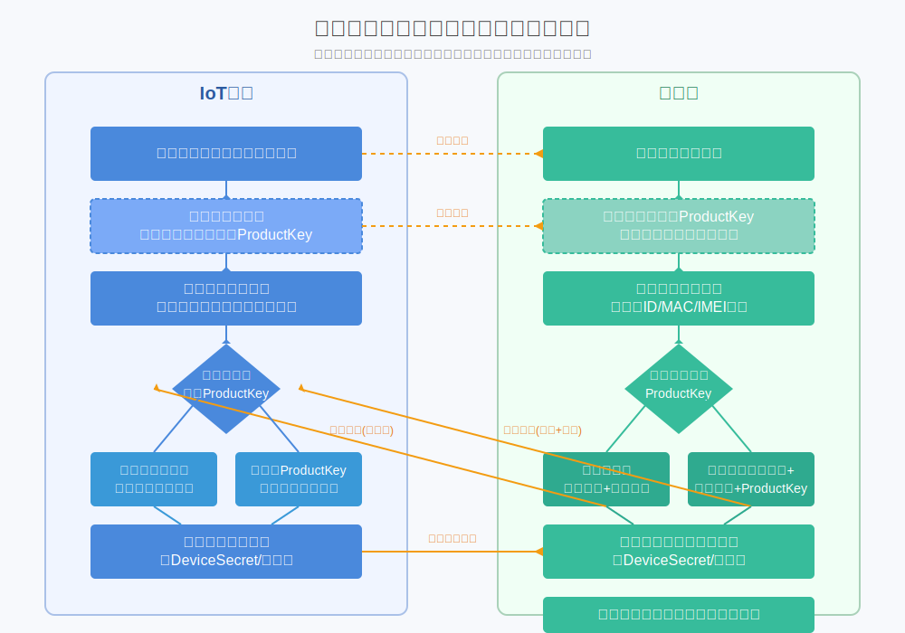
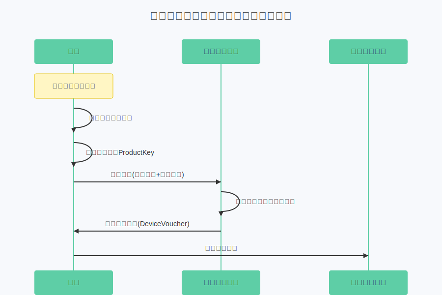

# One Type One Secret

## Core Principle


The core principle of "One Type One Secret" authentication is:

- **"One Type"**: Represents a class of devices sharing the same Type Secret (Template Secret).
- **"One Secret"**: Represents the exclusive unique connection credential (Voucher) eventually obtained by each device.

This mechanism balances production convenience and security, avoiding the complexity of pre-setting unique secrets for every single device.

### Three Key Stages

#### 1. Type Secret Preset Stage
- **Platform**: Create Device Template, generate Template Secret.
- **Device**: Preset Template Secret during production (shared by same type devices).

#### 2. Device Authentication Stage
- **Device**: Determine own unique ID (e.g., Chip ID, MAC, IMEI).
- **Device → Platform**: Send auth request containing Template Secret and Unique ID.
- **Platform**: Validate Template Secret and Unique ID.

#### 3. Credential Issuance Stage
- **Platform**: Generate unique connection credential for valid device.
- **Platform → Device**: Send credential.
- **Device**: Save credential for subsequent secure connections.

:::info

This mechanism effectively solves security and efficiency issues in large-scale IoT deployment, suitable for various platforms and scenarios.

:::

## ThingsPanel Design



### Flow with Template Secret Only


### Flow with Template Secret + ProductKey


## API Specification

### Dynamic Authentication Interface

**URL:** `POST /api/v1/device/auth`

**Description:** Supports One Type One Secret dynamic authentication.

#### Request Parameters

| Param | Type | Required | Description |
|--------|------|------|------|
| `template_secret` | string | ✅ | Template Secret |
| `device_number` | string | ✅ | Device Unique ID (MAC, IMEI, etc.) |
| `device_name` | string | ❌ | Device Name |
| `product_key` | string | ❌ | Product Key (for association) |
| `parent_device_number` | string | ❌ | Parent Device ID (Required for sub-device) |
| `sub_device_addr` | string | ❌ | Sub-device Address (Required for sub-device) |

#### Request Example

```json
{
  "template_secret": "your_template_secret",
  "device_number": "your_device_unique_id",
  "device_name": "DeviceName",
  "product_key": "your_product_key"
}
```

#### Response Parameters

| Param | Type | Description |
|--------|------|------|
| `code` | integer | Status code, 200 = Success |
| `message` | string | Message |
| `data` | object | Data |
| `└─ device_id` | string | Device ID |
| `└─ voucher` | string | Voucher |

#### Response Example

```json
{
  "code": 200,
  "message": "Success",
  "data": {
    "device_id": "4e7e16dc-b1e7-5eef-32a6-48a7d767c85f",
    "voucher": "{\"username\":\"6c2f1bdc-6fc2-b535-f0ba-f77fe9dc6db1\"}"
  }
}
```

## User Guide

### 🚀 Preparation
- Create Device Template and get Template Secret.
- Determine Device Unique ID.
- Prepare Product Key if needed.

### 📋 Process
1. Device sends auth request to `/api/v1/device/auth` on startup.
2. Platform validates.
3. Platform returns Device ID and Voucher.
4. Device saves Voucher.

### ⚠️ Notes
- Template Secret is shared, keep it safe.
- Device Unique ID must be globally unique.
- Securely store the Voucher.
- Cache Voucher locally after first auth.