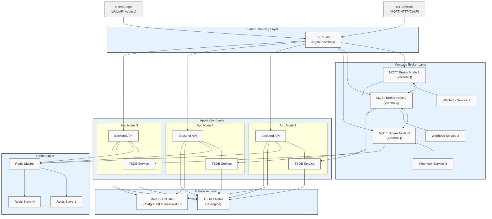

# Cluster Deployment

## Cluster Deployment Architecture

## 1. Overall Architecture

ThingsPanel adopts a layered architecture design, divided from top to bottom into Load Balancing Layer, Message Broker Layer, Application Layer, Cache Layer, and Database Layer. This layered architecture features high availability, scalability, and maintainability.

## 2. Detailed Layer Description

### 2.1 Access Layer

- **Device Onboarding**
  - Supports multiple protocols: MQTT, HTTP, CoAP
  - Supports massive concurrent device connections
  - Supports device authentication and security mechanisms

- **User Access**
  - Supports Web interface access
  - Provides standard REST API interfaces
  - Supports various client application integrations

### 2.2 Load Balancing Layer

- **Components**: Nginx/HAProxy Cluster
- **Functions**:
  - Implements load balancing for connections
  - Guarantees high availability
  - Supports horizontal scaling
  - Traffic control and security protection

### 2.3 Message Broker Layer

- **MQTT Broker Nodes (VerneMQ)**
  - Supports cluster deployment
  - Data synchronization between nodes
  - Real-time forwarding of device messages
  - Supports QoS guarantees

- **Webhook Service**
  - Tightly integrated with MQTT Broker
  - Provides message pre-processing capabilities
  - Supports custom message processing logic

### 2.4 Application Layer

- **Backend API Service**
  - Device Management
  - User Permission Management
  - Alert Management
  - Data Visualization

- **TSDB Service**
  - Efficient storage of device data
  - Data cleaning and transformation
  - Data analysis and processing
  - Historical data management

### 2.5 Cache Layer

- **Redis Cluster**
  - Uses Master-Slave architecture
  - Provides high-speed data caching
  - Supports session management
  - Improves system response speed

### 2.6 Database Layer

- **Time-Series Database (TDengine)**
  - Optimized for IoT data characteristics
  - High-performance data storage and query
  - Supports data compression
  - Provides data retention policies

- **Meta Database (PostgreSQL/TimescaleDB)**
  - Stores business metadata
  - Device configuration information
  - User and permission data
  - Supports complex business queries

## 3. System Characteristics

### 3.1 High Availability

- All layers support cluster deployment
- Designed with no single point of failure
- Service automatic fault tolerance and recovery
- Multi-replica data storage

### 3.2 Scalability

- Supports horizontal scaling
- Layers can be scaled independently
- Flexible node addition/removal
- Dynamic load balancing

### 3.3 Security

- Device onboarding security authentication
- Data transmission encryption
- User access permission control
- Multi-layer security protection

### 3.4 Maintainability

- Decoupled component design
- Easy issue localization
- Supports online upgrades
- Comprehensive monitoring and alerting

## 4. Deployment Recommendations

### 4.1 Small Scale Deployment (`<10k` Devices)

- Minimal component deployment
- Single node deployment is sufficient
- Recommended Config:
  - 2 Core 4GB+ Server
  - 100GB+ Storage

### 4.2 Medium Scale Deployment (10k-100k Devices)

- Recommended Dual-Node Cluster deployment
- Redundant backup for key components
- Recommended Config:
  - 4 Core 8GB+ Server
  - 500GB+ Storage

### 4.3 Large Scale Deployment (`>100k` Devices)

- Full Component Cluster deployment
- Cross-AZ Disaster Recovery
- Recommended Config:
  - 8 Core 16GB+ Server
  - 1TB+ Storage
  - Scale nodes based on actual demand

## 5. Scalability Recommendations

- Reserve over 50% performance margin
- Plan expansion in stages
- Monitor data storage capacity
- Perform regular performance assessments
