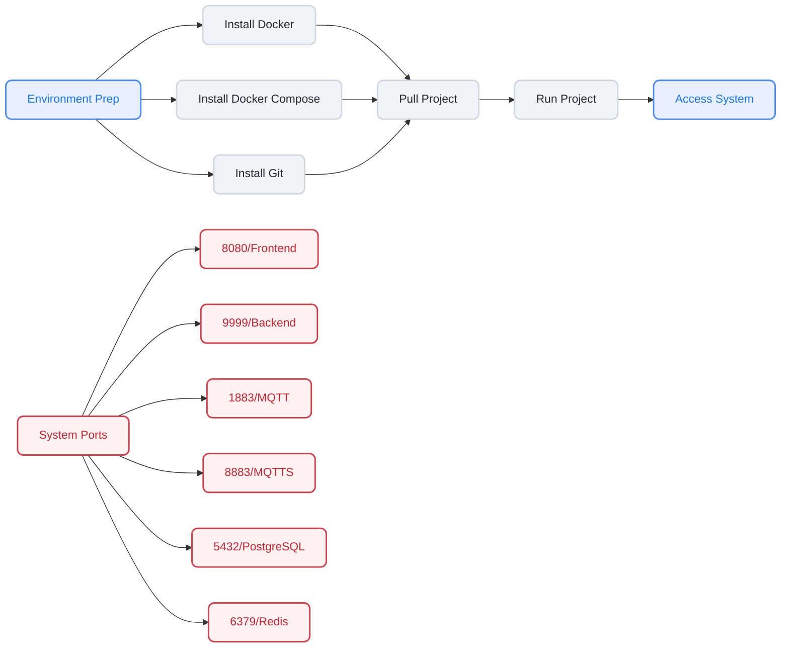

# Docker Installation

## Deployment Flow



## Environment Preparation

:::tip

For Windows environments, please install `Docker Desktop` and `git`.

:::

### Install Docker

- **Install Docker (CentOS)**

  ```bash
  dnf config-manager --add-repo https://download.docker.com/linux/centos/docker-ce.repo
  dnf install docker-ce docker-ce-cli containerd.io
  systemctl start docker.service
  systemctl enable docker.service
  ```

- **Install Docker Compose**

:::tip
  If Docker Compose v2.9.0 fails to run, you can download v2.10.0.
  If you want to use a newer version of Docker Compose, please modify the `docker-compose.yml` file in the project accordingly.
:::

  ```bash
  curl -L "https://github.com/docker/compose/releases/download/v2.9.0/docker-compose-$(uname -s)-$(uname -m)" -o /usr/local/bin/docker-compose
  chmod +x /usr/local/bin/docker-compose
  ```

  Alternative download link if the above is slow:

  ```bash
  curl -L "https://get.daocloud.io/docker/compose/releases/download/v2.9.0/docker-compose-$(uname -s)-$(uname -m)" -o /usr/local/bin/docker-compose
  chmod +x /usr/local/bin/docker-compose
  ```

- **If Git is not installed**

  ```bash
  dnf install git -y
  ```

### Installation with Mirror Acceleration

[Debian System Installation Guide](https://docs.qq.com/doc/DZVZtdXBPdFJxV05C)  
[CentOS System Installation Guide](https://docs.qq.com/doc/DZUlaZG50dG1RdHB0)  
[Ubuntu System Installation Guide](https://docs.qq.com/doc/DZW13a1FzeGxiQk5J)  
[AlmaLinux System Installation Guide](https://docs.qq.com/doc/DZWNWZU9LZUxwTWVs)  

## Start Installation

- **Pull Project**

  ```bash
  # Pull docker configuration
  git clone https://github.com/ThingsPanel/thingspanel-docker.git
  cd thingspanel-docker
  ```

- **Run Project**

  > In the `thingspanel-docker` directory (Windows users need to open a `cmd` window)
  >

  ```bash
  # Start project in foreground (default port 8080)
  docker-compose -f docker-compose.yml up
  # Or start in background
  docker-compose -f docker-compose.yml up -d
  # Stop services
  docker-compose -f docker-compose.yml down
  ```

- **Login**

  - Open browser and enter **ServerIP:8080**
  - System Admin: super@super.cn / 123456
  - Tenant Admin: tenant@tenant.cn / 123456

## Volume Mapping

- **Configuration, Logs, and other diff files**

  ```bash
  ./data
  ```

- **Docker Volume Names**

  ```bash
  go
  gmqtt
  nginx
  ```

## View Container Logs

```bash
docker logs -f containerID
```

## Port Description

```bash
8080 (Frontend Service)
9999 (Backend API)
1883 (MQTT)
8883 (MQTTS)
5432 (PostgreSQL)
6379 (Redis)
```

:::tip Device Connection

For device connection instructions, please refer to:
[`MQTT Connection`](../device-connectivity/mqtt)

:::
