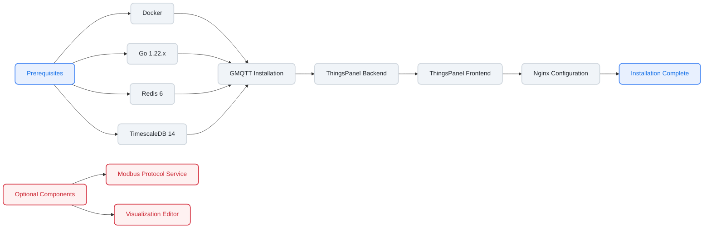

# Source Code Installation

## Installation Flowchart



## 1. System Environment Installation

Before starting ThingsPanel, please ensure the following environments are installed:

### 1. Go 1.22.x 
[Download](https://go.dev/dl/) [Install](https://go.dev/doc/install)

:::tip
After installation, you may need to configure a proxy if you are in China.
:::

```bash
go env -w GO111MODULE=on;go env -w GOPROXY=https://goproxy.cn
```

### 2. Docker

We use Docker to simplify database installation.
[Install Docker Community Edition](https://docs.docker.com/engine/install/)

### 3. Redis 6

Supports higher versions and traditional deployment. [Installation Guide](https://redis.io/docs/getting-started/installation/install-redis-from-source/)

Docker deployment method:

**Option 1: Official Image (International Network)**
```bash
mkdir -p /home/tp/backend/redis/{data,conf,logs}
docker run --name tp-redis -d \
  --restart always \
  -p 6379:6379 \
  -v /home/tp/backend/redis/data:/data \
  -v /home/tp/backend/redis/conf:/usr/local/etc/redis \
  -v /home/tp/backend/redis/logs:/logs \
  redis redis-server --requirepass redis
```

**Option 2: Domestic Mirror (Recommended for China)**
```bash
mkdir -p /home/tp/backend/redis/{data,conf,logs}
docker run --name tp-redis -d \
  --restart always \
  -p 6379:6379 \
  -v /home/tp/backend/redis/data:/data \
  -v /home/tp/backend/redis/conf:/usr/local/etc/redis \
  -v /home/tp/backend/redis/logs:/logs \
  registry.cn-hangzhou.aliyuncs.com/thingspanel/redis:6.2.7 redis-server --requirepass redis
```

Choose one of the above commands based on your network environment.

### 4. TimescaleDB 14

Supports higher versions and traditional deployment. [Installation Guide](https://docs.timescale.com/install/latest/installation-docker/)

**Option 1: Official Image (International Network)**
```bash
mkdir -p /home/tp/data/dir
docker run --name timescaledb -d \
  --restart always \
  -p 5432:5432 \
  -e TZ=Asia/Shanghai \
  -e POSTGRES_DB=ThingsPanel \
  -e POSTGRES_USER=postgres \
  -e POSTGRES_PASSWORD=postgresThingsPanel \
  -v /home/tp/data/dir:/var/lib/postgresql/data \
  timescale/timescaledb:latest-pg14
```

**Option 2: Domestic Mirror (Recommended for China)**
```bash
mkdir -p /home/tp/data/dir
docker run --name timescaledb -d \
  --restart always \
  -p 5432:5432 \
  -e TZ=Asia/Shanghai \
  -e POSTGRES_DB=ThingsPanel \
  -e POSTGRES_USER=postgres \
  -e POSTGRES_PASSWORD=postgresThingsPanel \
  -v /home/tp/data/dir:/var/lib/postgresql/data \
  registry.cn-hangzhou.aliyuncs.com/thingspanel/timescaledb:14
```

Choose one of the above commands based on your network environment.

#### Configuration Details

- **Database Name**: ThingsPanel
- **Username**: postgres
- **Password**: postgresThingsPanel
- **Port**: 5432

> **Note**: If you modify the database configuration, please update the backend configuration file (`./configs/conf.yml`) correspondingly.

## 2. GMQTT Installation

GMQTT is the service for device message access. Device messages enter the platform via GMQTT, and the platform sends messages to devices via GMQTT.

1. Go to [GMQTT Repository](https://github.com/ThingsPanel/thingspanel-gmqtt)
2. Star the repository.
3. Download the source code. It is recommended to use `git clone`. (If git is not installed, download the zip package). Note the branch: `main` is the latest development branch. Check Tags for other versions.

### Configuration Files

```text
./thingspanel-gmqtt/cmd/gmqttd/default_config.yml        -- System Configuration
./thingspanel-gmqtt/cmd/gmqttd/thingspanel.yml           -- ThingsPanel Plugin Configuration
```

`default_config.yml` explanation:
```yml
log:
  level: info # Log level: debug | info | warn | error
```

`thingspanel.yml` explanation:
```yml
db:
  redis:
    # Redis connection string
    conn: 127.0.0.1:6379
    # Redis database number
    db_num: 1
    # Redis password
    password: "redis"
  psql:
    psqladdr: "127.0.0.1"
    psqlport: 5432
    psqldb: ThingsPanel
    psqluser: postgres
    psqlpass: postgresThingsPanel
mqtt:
  # Password for root user
  broker: localhost:1883
  password: "root"
  plugin_password: "plugin"
```

### Run Service (Recommended)

Three methods are available:

#### Direct Run

```sh
$ git clone https://github.com/ThingsPanel/thingspanel-gmqtt.git
$ cd thingspanel-gmqtt/cmd/gmqttd
$ go run . start -c default_config.yml
```

#### Managed by PM2 (Recommended)

We recommend using PM2 to manage the service. (PM2 requires Node.js. Installation is simple, please search online if needed).

1. `git clone https://github.com/ThingsPanel/thingspanel-gmqtt.git`
2. `cd thingspanel-gmqtt/cmd/gmqttd`, create `gmqtt.sh` in this directory.
3. Write `go run . start -c default_config.yml` into `gmqtt.sh`.
4. `chmod 777 gmqtt.sh`
5. `pm2 start gmqtt.sh` to start GMQTT. (After `pm2 save`, the process state will be saved and automatically restored after system reboot).

#### Run via Docker

```sh
$ git clone https://github.com/ThingsPanel/thingspanel-gmqtt.git
$ cd thingspanel-gmqtt
$ docker build -t gmqtt .
$ docker run -p 1883:1883 -p 8883:8883 -p 8082:8082 -p 8083:8083  -p 8084:8084  gmqtt
```

## 3. ThingsPanel-Backend-Community Installation

The platform uses a separated frontend-backend architecture. ThingsPanel-Backend-Community provides API services for the frontend and device onboarding services. It needs to connect to GMQTT and the database (ensure `./configs/conf.yml` matches the database username/password set during installation).

1. Go to [ThingsPanel-Backend-Community Repository](https://github.com/ThingsPanel/thingspanel-backend-community)
2. Star the repository.
   
3. Download source code (`git clone` recommended). `main` is the latest development branch.
   

### Directory Structure

```text
./configs/conf.yml                  -- System Configuration
./files/logs/                       -- Log Directory
./sql/                              -- Database Initialization Scripts (Auto-executed on startup)
```

1. `./configs/conf.yml` Configuration Explanation

```yml
# To set configuration via environment variables, use GOTP_ prefix, e.g., GOTP_DB_PSQL_DBTYPE for db.psql.dbType

service:
  http: 
    host: 0.0.0.0 # Default localhost
    port: # Default 9999

log:
  # 0-Console 1-File 2-File and Console
  adapter_type: 0
  # Max days to keep log files
  maxdays: 7
  # Log level (panic fatal error warn info debug trace)
  level: debug # Default info
  # Max lines per file
  maxlines: 10000

jwt:
  key: 1hj5b0sp9

db:
  psql:
    host: 127.0.0.1 # Default localhost
    port: 5432 # Default 5432
    dbname: ThingsPanel # Database Name
    username: postgres # Database Username
    password: postgresThingsPanel # Database Password
    time_zone: Asia/Shanghai # Default Asia/Shanghai

    idle_conns: 5 # Max idle connections, suggest 5-20% of open_conns
    open_conns: 50 # Max open connections (TimescaleDB defaults to 100, set to 50 for sharing with other services)
    # SQL Log Level (1-Silent 2-Error 3-Warn 4-Info)
    log_level: 4 # Default 1
    # Slow SQL Threshold (ms). Logged if sqlloglevel >= 3.
    slow_threshold: 200 # Default 200ms

  redis:
    addr: 127.0.0.1:6379 # Default localhost:6379
    db: 1 # Default 0
    password: "redis"

grpc:
  tptodb_server: 127.0.0.1:50052
  tptodb_type: NONE

# MQTT Server: gmqtt, vernemq
mqtt_server: gmqtt

mqtt:
  access_address: 47.92.253.145:1883
  broker: 127.0.0.1:1883 # Default localhost:1883
  user: root # Default root
  pass: root # Default root
  channel_buffer_size: 10000 # Default 10000
  write_workers: 1 # DB write threads, default 10
  # QoS: 0-At most once, 1-At least once, 2-Exactly once
  
  telemetry: # Telemetry
    # devices/telemetry/control/{device_number}
    publish_topic: devices/telemetry/control/  # Platform publishes telemetry control
    subscribe_topic: devices/telemetry   # Platform subscribes to telemetry
    gateway_subscribe_topic: gateway/telemetry # Platform subscribes to gateway telemetry
    gateway_publish_topic: gateway/telemetry/control/%s  # Platform publishes gateway telemetry control
    pool_size: 10 # Thread pool, default 100
    batch_size: 100 # Default 100, max batch write
    qos: 0
  attributes: # Attributes
    subscribe_topic: devices/attributes/+
    publish_response_topic: devices/attributes/response/
    publish_topic: devices/attributes/set/
    subscribe_response_topic: devices/attributes/set/response/+
    publish_get_topic: devices/attributes/get/
    
    gateway_subscribe_topic: gateway/attributes/+
    gateway_publish_response_topic: gateway/attributes/response/%s/%s
    gateway_publish_topic: gateway/attributes/set/%s/%s
    gateway_subscribe_response_topic: gateway/attributes/set/response/+
    gateway_publish_get_topic: gateway/attributes/get/%s
    qos: 1
  commands: # Commands
    publish_topic: devices/command/
    subscribe_topic: devices/command/response/+
    gateway_subscribe_topic: gateway/command/response/+
    gateway_publish_topic: gateway/command/%s/%s
    qos: 1
  events: # Events
    subscribe_topic: devices/event/+
    publish_topic: devices/event/response/
    gateway_subscribe_topic: gateway/event/+
    gateway_publish_topic: gateway/event/response/%s/%s
    qos: 1
  ota: # OTA
    publish_topic: ota/devices/infrom/
    subscribe_topic: ota/devices/progress
    qos: 1

mqtts:
  broker: 127.0.0.1:8883
  user: root
  pass: root
  caPath : ./conf/certificate/ca.crt
  crtPath: ./conf/certificate/client.crt
  keyPath : ./conf/certificate/client.key

automation_task_confg:
  once_task_limit: 100
  periodic_task_limit: 100

ota:
  # OTA package download address pushed to devices
  download_address: http://demo.thingspanel.cn 
```

### Run

Start GMQTT, Redis, TimescaleDB first, then start thingspanel-backend-community:

```sh
$ git clone https://github.com/ThingsPanel/thingspanel-backend-community.git
$ cd thingspanel-backend-community
$ go run . 
```

## 4. ThingsPanel-Frontend-Community Installation & Build

### Download Latest Dist Package (Easiest)

Go to [ThingsPanel-Frontend-Community Releases](https://github.com/ThingsPanel/thingspanel-frontend-community/releases), download the `dist` zip with the `latest` tag.

### Install Node.js 20.11.0 (For building from source)

[Install Node.js](https://nodejs.org/download/release/)

1. Click the link above.
2. Find `v20.11.0` and download `node-v20.11.0-linux-x64.tar.xz`.

```bash
wget https://nodejs.org/download/release/v20.11.0/node-v20.11.0-linux-x64.tar.xz
```

3. Follow [Node.js Installation Guide](https://github.com/nodejs/help/wiki/Installation).

### Build Frontend from Source

1. Download Source Code

```bash
git clone https://github.com/ThingsPanel/thingspanel-frontend-community.git
```

2. Install Dependencies

```bash
npm install -g pnpm
pnpm install
```
**Note:** If you encounter `npm ERR! Unsupported URL Type "workspace:"`, it's because you used `npm install`. Use `pnpm` instead.

3. Build Dist

```bash
pnpm build
```

## 5. Optional: Install Modbus Protocol Plugin

Modbus-protocol-plugin facilitates the connection of Modbus devices, forwarding data to GMQTT for the platform.

1. Go to [Modbus Protocol Plugin Repository](https://github.com/ThingsPanel/modbus-protocol-plugin)
2. Star the repo.
3. Download source code.

### Configuration

```text
./config.yaml        -- Configuration File
```

`config.yaml` explanation:

```yaml
server:
  address: 0.0.0.0:502 # Device onboarding address
mqtt:
  broker: 127.0.0.1:1883 # GMQTT Broker address
  username: root
  password: root
  topic_to_publish: device/attributes # Publish topic
  topic_to_subscribe: plugin/modbus/# # Subscribe topic
  subscribe_pool: 100 # Concurrency pool
http_server:
  address: 0.0.0.0:503 # HTTP service address
thingspanel:
  address: 127.0.0.1:9999 # ThingsPanel Platform Address
```

### Run

```sh
$ git clone https://github.com/ThingsPanel/modbus-protocol-plugin.git
$ cd modbus-protocol-plugin
$ go run . start
```

## 6. Optional: Visual Editor Installation & Build (Community Edition)

### Install Pnpm

```
npm i -g pnpm
```

### Build Visual Editor from Source

1. Download Source Code

```bash
git clone https://github.com/ThingsPanel/visual-editor.git
```

2. Install Dependencies

```bash
npm install
```

3. Build Dist

```bash
pnpm run build
```

## 7. Optional: Install Rule Engine

Please refer to the README at https://github.com/ThingsPanel/rule-engine for installation instructions.

## 8. Install Nginx

```sh
yum install nginx
```

### Nginx Configuration

After installation, create `tp.conf` in `/etc/nginx/conf.d`. Copy the content below. 
Copy the **frontend dist files** to `/usr/share/nginx/html` (or modify the root path in config).
Copy the **visual editor dist files** to `/usr/share/nginx/visual-editor/dist`.

**Note: Modify configuration to match your environment.**

```conf
server {
    listen 8080;
    server_name 192.168.1.1 ; # Public IP, LAN IP, or Domain
    charset utf-8;
    client_max_body_size 10m;
    root /home/dev/dist;
  
    gzip on;
    gzip_min_length 1k;
    gzip_comp_level 6;
    gzip_types text/plain application/javascript application/x-javascript text/css application/xml text/javascript application/x-httpd-php image/jpeg image/gif image/png;
    gzip_vary on;
    gzip_disable "MSIE [1-6]\.";

    location /api {
        proxy_http_version 1.1;
        proxy_set_header Upgrade $http_upgrade;
        proxy_set_header Connection "upgrade";
        proxy_set_header X-real-ip $remote_addr;
        proxy_set_header X-Forwarded-For $remote_addr;
        proxy_pass  http://127.0.0.1:9999;
    }
    location /ws {
        proxy_http_version 1.1;
        proxy_set_header Upgrade $http_upgrade;
        proxy_set_header Connection "upgrade";
        proxy_set_header X-real-ip $remote_addr;
        proxy_set_header X-Forwarded-For $remote_addr;
        proxy_pass  http://127.0.0.1:9999;
    }
    location /files {
        proxy_http_version 1.1;
        proxy_set_header Upgrade $http_upgrade;
        proxy_set_header Connection "upgrade";
        proxy_set_header X-real-ip $remote_addr;
        proxy_set_header X-Forwarded-For $remote_addr;
        proxy_pass  http://127.0.0.1:9999;
        
        add_header 'Access-Control-Allow-Origin' '*';
        add_header 'Access-Control-Allow-Credentials' 'true';
        add_header 'Access-Control-Allow-Methods' 'GET, POST, OPTIONS';
        add_header 'Access-Control-Allow-Headers' 'DNT,User-Agent,X-Requested-With,If-Modified-Since,Cache-Control,Content-Type,Range';
        add_header 'Access-Control-Expose-Headers' 'Content-Length,Content-Range';
    }
  
    # Visualization Editor
    location /visual {
        alias /home/visual-editor/dist;
        index index.html index.htm;
        try_files $uri $uri/ /visual/index.html;
    }
  
    location / {
        index index.html index.htm;
        try_files $uri $uri/ /index.html;
    }
}
```

### Restart Nginx

```sh
nginx -t
nginx -s reload
```

:::info

## 9. Installation Complete

- **Login**
  - Open browser: **ServerIP:8080**
  - System Admin: super@super.cn / 123456
  - Tenant Admin: tenant@tenant.cn / 123456
  
If you need help, please contact us. `QQ Group: 371794256`

:::

:::info

For more info, check the README in the [`Code Repository`](../introduction/code_repository).

:::
