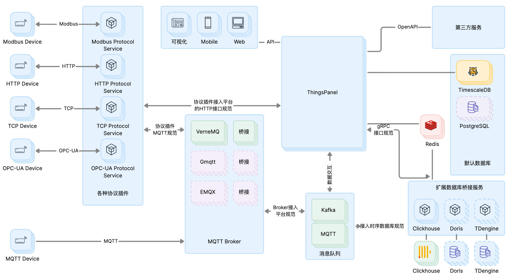
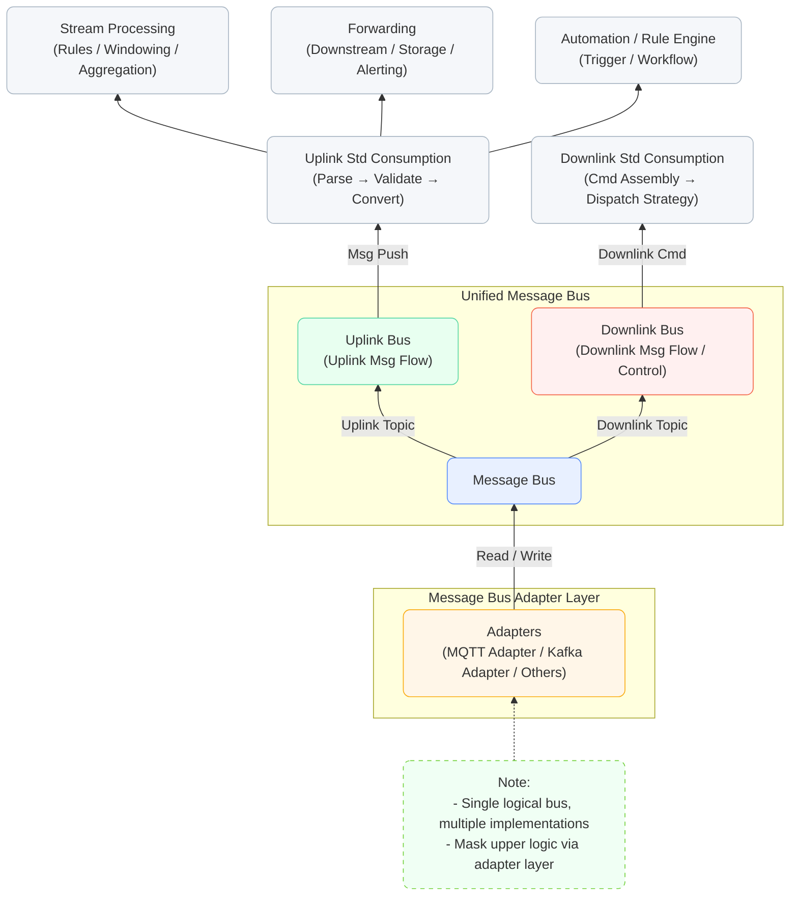

# System Architecture

**ThingsPanel Design Advantages**:

- **High-Performance Distributed Architecture**: Built on leading open-source technologies, supporting horizontal scaling. Single nodes support tens of thousands of devices, while clusters can handle millions.
- **Flexible Plugin Design**: Logic is extended via plugins, easily adding new functions and adapting to new devices. Supports flexible extension of protocols, databases, and services.
- **High Availability**: All nodes in the cluster are equal with no single point of failure, supporting automatic fault tolerance and recovery.
- **Open Integration**: Provides standardized APIs for rapid integration with third-party systems.

See the architecture diagram and key components below.

## ThingsPanel System Architecture Diagram

**Legend**:

- **Device Connectivity Service**: ThingsPanel supports various communication protocols including Modbus, HTTP, TCP, OPC-UA, etc., connecting to IoT devices via corresponding connectivity services. This design helps users easily expand to new devices and protocols, ensuring compatibility with a vast array of IoT devices.

- **MQTT Broker Cluster**: Integrates with high-performance MQTT Brokers like VerneMQ and GMQTT to provide reliable messaging services for IoT devices. Users can select the appropriate Broker based on their needs.

- **Database**: Supports distributed databases like Cassandra and TDengine. This provides high availability, scalability, and flexibility for data storage, offering an efficient and reliable solution for IoT data.

- **Deployment**: The architecture is designed for high availability and scalability, ensuring no single point of failure. Every component can be scaled horizontally.

- **Device Connectivity Service**: Through this design, ThingsPanel can easily extend new functions and services to meet changing business requirements.

- **Plugin System**: Protocols, databases, and Brokers are all implemented as plugins. This modular design facilitates the addition of new features and device adaptations while simplifying maintenance.

- **Cross-Platform Access**: Supports access via Mobile and Web terminals, allowing users to manage their IoT devices from anywhere.

- **API Ecosystem**:
  - **REST API**: Standard HTTP interfaces for device management and data queries.
  - **WebSocket**: Real-time data push and device status monitoring.
  - **Authentication**: Supports Token, Signature, and other authentication methods.
  - **Data Services**: Real-time data subscription, historical data query, and batch processing.

- **Centralized Management**: As a core management platform, ThingsPanel centralized the handling of multi-protocol device data, simplifying management and boosting efficiency.

---

## ThingsPanel IoT Message Bus Architecture

---

### Architecture Overview

This architecture is centered around a **Unified Message Bus**, building a loosely coupled, highly scalable, and observable IoT organizational system. It uses an **Adapter Layer** to mask protocol differences (MQTT, Kafka, etc.), creating standardized processing for Uplink and Downlink messages, stream computing, and command control.

The structure consists of three layers:

| Layer | Module | Functional Positioning |
| :--- | :--- | :--- |
| **Adapter Layer** | Adapters (MQTT / Kafka / Others) | Connects various protocols and converts them to a unified bus format. |
| **Message Bus Layer** | Unified Message Bus, Uplink/Downlink Streams | Carries bidirectional message flow, achieving decoupling and isolation. |
| **Processing & Automation Layer** | Uplink Consumption, Stream Processing, Forwarding, Automation, Downlink Assembly | Implements data processing and control logic. |

---

### Module Description

#### 1. Message Bus Adapter Layer (Adapters)

* Supports **MQTT, Kafka**, and other message queues.
* Converts device messages into a unified bus format via adapter modules.
* Masks differences in underlying communication protocols, providing a consistent interface for upper layers.

> ✅ **Benefit:** No need to modify upper-layer business logic when accessing new protocols.

#### 2. Unified Message Bus

* The core communication hub of the architecture.
* Provides **Uplink** and **Downlink** bidirectional message streams:
  * **Uplink**: Device → Platform (Status reports, Event notifications, etc.)
  * **Downlink**: Platform → Device (Control commands, Configuration push, etc.)
* Supports **Topic** mechanism for flexible subscription and broadcasting.

> ✅ **Benefit:**
> * Decouples device side from business side;
> * Enables parallel development of multiple modules;
> * Improves system scalability and stability.

#### 3. Uplink Data Processing Chain

| Module | Function |
| :--- | :--- |
| **Uplink Standard Consumption** | Message parsing, validation, conversion to standard data models. |
| **Stream Processing** | Real-time rule calculation, window aggregation, data filtering. |
| **Forwarding Module** | Pushing result data to downstream systems (Databases, Alerts, Analytics). |
| **Automation/Rule Engine** | Triggering actions based on events (e.g., Alarms, Control Commands, Workflows). |

> ✅ **Value:** Enables real-time decision-making and business linkage, making IoT data actionable.

#### 4. Downlink Control Chain

| Module | Function |
| :--- | :--- |
| **Downlink Standard Consumption** | Converting upper-layer commands into device-recognizable protocol formats. |
| **Config/Control Module** | Managing downlink strategies (Rate limiting, Retries, Priorities, Timeout control). |

> ✅ **Value:** Improves command reliability and controllability, ensuring safe and effective device operations.

---

### Architectural Advantages

| Advantage Category | Description |
| :--- | :--- |
| **Unified Communication Standard** | Protocol unification and topic-based management via Message Bus. |
| **High Scalability** | Decoupling of Adapter and Bus allows free extension of device types and protocols. |
| **High Maintainability** | Independent deployment and extension of processing modules facilitate gray releases and hot updates. |
| **Real-time & High Reliability** | Stream processing and strategy control ensure real-time data and reliable commands. |
| **Business Flexibility** | Rapid implementation of complex business logic. |
| **Ecosystem Compatibility** | Easy integration with Big Data, AI, Alerting, and Storage systems. |

### Value for Users and Enterprises

| User/Enterprise Type | Value Gained |
| :--- | :--- |
| **Device Manufacturers** | Quick platform access without worrying about low-level protocol adaptation. |
| **Developers** | Use unified interfaces to implement data consumption and control logic. |

---

## ThingsPanel IoT Platform Data Flow Architecture

---

This architecture designs a five-layer data processing pipeline responsible for managing the **entire Uplink and Downlink data flow** from IoT devices to Applications/Databases.

### Core Architecture Layers & Responsibilities

| Layer | Core Responsibility | Example |
| :--- | :--- | :--- |
| **Adapter (Protocol Adaptation)** | Masks protocol differences, unifies data formats. | Message queue adapters supporting **MQTT, Kafka**. |
| **Uplink (Uplink Processing)** | Routes, decodes, and distributes uplink data. | Calls Processor for decoding, sends telemetry to **Storage and Forwarder**. |
| **Processor (Data Processing)** | Executes scripts for data encoding/decoding (Raw $\leftrightarrow$ Standard JSON). | Runs **Lua Scripts** to convert custom device formats to platform standard JSON. |
| **Storage** | Optimizes database writes. | **Batch writes** telemetry history, updates latest values, stores attributes/events. |
| **Downlink (Downlink Commands)** | Handles platform command requests, encodes and sends to devices. | Encodes API command requests and sends to devices via **Adapter**. |

---

### Value Analysis & Comparison

#### Core Problems Solved

| Pain Point | Solution |
| :--- | :--- |
| **Code Coupling, Hard to Maintain** | Introduced 5-layer architecture with **Separation of Concerns** (e.g., Adapter for protocol only, Processor for scripts only). |
| **Difficult Protocol Extension** | **Adapter Layer Abstraction** supports MQTT, Kafka; adding new protocols only requires implementing a new Adapter. |
| **Processing Performance Bottlenecks** | Uses **Channel Asynchronous Processing, Batch Writes (Telemetry), Script Caching, Coroutine Pools** to achieve high concurrency and performance. |
| **Lack of Monitoring** | Comprehensive **Logging and Metrics System (Prometheus)** enhances observability. |

#### Core Benefits (Architectural Advantages)

1.  **High Scalability (Protocol Agnostic)**: `Adapter/Publisher` interface design makes onboarding new protocols extremely low cost.
2.  **High Concurrency & Performance**:
    * **Asynchronous Message Bus (Bus/Channel)**: Decoupling and **Backpressure Control** between layers.
    * **Batch Writes**: Optimized for telemetry data.
    * **Script Sandbox & Caching**: Ensures execution efficiency and safety.
3.  **High Cohesion, Low Coupling**: Modules are highly independent, facilitating **Unit Testing, Module Replacement, and Independent Maintenance**.
4.  **Complete Functionality**: Covers **Core IoT Functions** like data decoding, gateway splitting, historical data, heartbeat status, command downlink, and data forwarding.

#### Competitive Advantages

The advantage lies in its clear **Layering** and optimization of key **Performance Points**:

* **Proper Design Patterns**: Effectively uses **Producer-Consumer** (Channel), **Adapter**, and **Strategy** patterns (Processor), avoiding "God Functions".
* **Performance & Features**: Balances high-performance mechanisms (Batching, Async) with complex business processing (Gateway splitting, History support).
* **Controllable Data Flow**: Clear uplink/downlink responsibilities make **Fault Localization and Traceability** simple.

---

### Value for Users (Platform Operators)

| Aspect | User Value |
| :--- | :--- |
| **Stability & Reliability** | **High Concurrency, Async Processing**, and Fault Tolerance ensure **No Data Loss, No Backlog**. |
| **Rapid Device Onboarding** | Processor Layer abstraction allows users to write **Lua Scripts** for encoding/decoding, quickly integrating new devices and custom protocols. |
| **Flexible Platform Integration** | **Forwarder Mechanism** allows forwarding processed standard data to other systems (Data Lakes, Business Apps), facilitating integration. |
| **Observability** | Comprehensive **Logs and Monitoring Metrics** enable operations to quickly discover and locate issues. |
