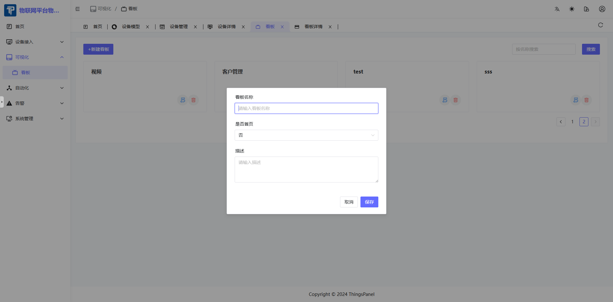

# Dashboard

## 1. Description
- Click Visualization - Dashboard to enter the Dashboard Management page. Dashboard management is mainly for configuring the dashboards to be displayed, with functions to create, edit, delete dashboards, and select whether to display the dashboard on the home page.

## 2. Operations

### 2.1 Create Dashboard

- Click "New Dashboard" to open the popup. Enter dashboard name, whether to display on home page, description, etc. Currently, only one dashboard can be displayed on the home page.

- After setting to display on home page, the dashboard will have a "Home" tag, as shown below.

### 2.2 Edit Dashboard Name

- Select the dashboard to edit, click the Edit button to open the edit popup.

### 2.3 Delete Dashboard

- Select the dashboard to delete, click Delete.

### 2.4 Edit Dashboard Chart

- Click the dashboard to edit the display chart. After entering, click Edit to edit the required chart components.

