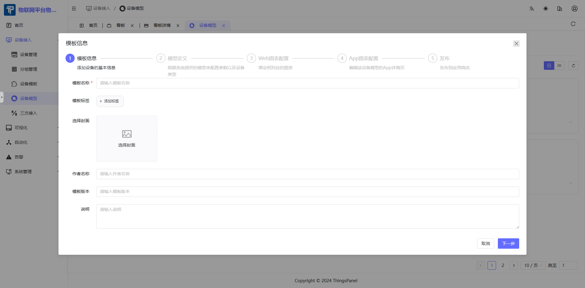

# Product Model

The purpose of the Product Model (Thing Model) is to reuse data definitions and charts.

## 1. Description
- Click Device Onboarding - Product Model to enter the management page.
- Product Model corresponds to real-world product names, e.g., "Temp & Hum Sensor" in "Brand X Temp & Hum Sensor".
- Defines charts and data structures.
- Charts for Apps can be pre-configured for efficient device onboarding.
- Product Model can be called by Device Templates.

## 2. Operations

### 2.1 Create Product Model

- Click "Add Product Model" to create new.
- Set Template Name, Tags, etc.

### 2.2 Configure Product Model

- Configure mapping relations for Telemetry, Attributes, Events, Commands parameter data names and identifiers.

### 2.3 Configure Charts

- Select charts to display and data sources.

### 2.4 Configure App Charts

- View App chart styles.

### 2.5 Complete Configuration

- View template info and complete configuration.

