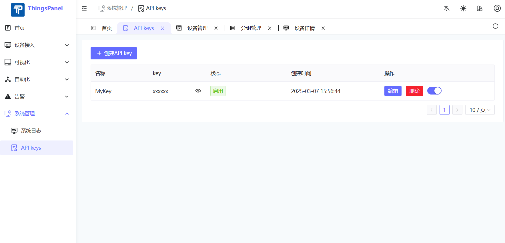

# API Keys Management



API Keys Management provides a convenient interface access credential management solution for third-party developers. Through this function, you can create and manage API Keys for accessing open interfaces.

## Usage

1. **Create API Key**: Click the Add button in the interface to generate a new API Key.
2. **Apply API Key**: In third-party applications, simply add the following parameter to the HTTP request header to complete authentication:
   ```
   x-api-key: YOUR_API_KEY
   ```

3. **Manage Existing Keys**:
   - Edit: Modify Key description or permissions.
   - Delete: Revoke API Key to immediately terminate its access.

## Notes for Developers

- API Keys should be kept safe and not exposed in public places or code repositories.
- It is recommended to use independent API Keys for each application for separate management and tracking.
- The system automatically records the usage of each Key for easier troubleshooting.

Through this function, third-party developers can easily integrate open interfaces provided by the system to achieve customized development and system expansion.
