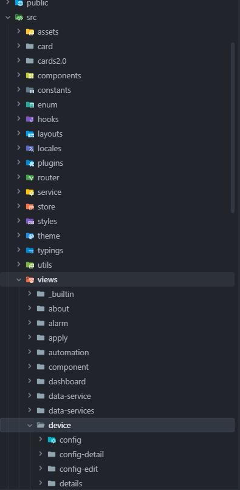
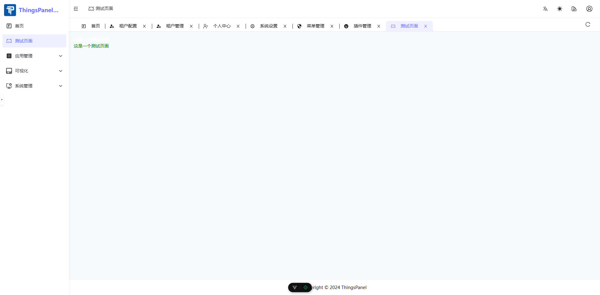

# 菜单和页面

## 一、概述
如果系统提供的菜单或页面无法满足您的需求，可以开发自己想要的页面然后在权限管理页面新建菜单，链接到您的自定义页面。
### 项目目录结构
```
thinspanel
├── .vscode                        //vscode插件和设置
│   ├── extensions.json            //vscode推荐的插件
│   ├── launch.json                //debug配置文件(debug Vue 和 TS)
│   └── settings.json              //vscode配置(在该项目中生效，可以复制到用户配置文件中)
├── build                          //vite构建相关配置和插件
│   ├── config                     //构建打包配置
│   │   └── proxy.ts               //网络请求代理
│   └── plugins                    //构建插件
│       ├── index.ts               //插件汇总
│       ├── router.ts              //elegant-router插件
│       ├── unocss.ts              //unocss插件
│       └── unplugin.ts            //自动导入UI组件、自动解析iconify图标、自动解析本地svg作为图标
├── packages                       //子项目
│   ├── axios                      //网络请求封装
│   ├── color-palette              //颜色调色板
│   ├── hooks                      //组合式函数hooks
│   ├── materials                  //组件物料
│   ├── ofetch                     //网络请求封装
│   ├── scripts                    //脚本
│   ├── uno-preset                 //uno-preset配置
│   └── utils                      //工具函数
├── public                         //公共目录(文件夹里面的资源打包后会在根目录下)
│   └── favicon.svg                //网站标签图标
├── src
│   ├── assets                     //静态资源
│   │   ├── imgs                   //图片
│   │   └── svg-icon               //本地svg图标
│   ├── components                 //全局组件
│   │   ├── advanced               //高级组件
│   │   ├── common                 //公共组件
│   │   └── custom                 //自定义组件
│   ├── constants                  //常量
│   │   ├── app.ts                 //app常量
│   │   ├── business.ts            //业务常量
│   │   ├── common.ts              //通用常量
│   │   └── reg.ts                 //正则常量
│   ├── enums                      //枚举
│   ├── hooks                      //组合式的函数hooks
│   │   ├── business               //业务hooks
│   │   │   ├── auth               //用户权限
│   │   │   └── captcha            //验证码
│   │   └── common                 //通用hooks
│   │       ├── echarts            //echarts
│   │       ├── form               //表单
│   │       ├── icon               //图标
│   │       ├── router             //路由
│   │       └── table              //表格
│   ├── layouts                    //布局组件
│   │   ├── base-layout            //基本布局(包含全局头部、多页签、侧边栏、底部等公共部分)
│   │   ├── blank-layout           //空白布局组件(单个页面)
│   │   ├── context                //布局组件的上下文状态
│   │   ├── hooks                  //布局组件的hooks
│   │   └── modules                //布局组件模块
│   │       ├── global-breadcrumb  //全局面包屑
│   │       ├── global-content     //全局主体内容
│   │       ├── global-footer      //全局底部
│   │       ├── global-header      //全局头部
│   │       ├── global-logo        //全局Logo
│   │       ├── global-menu        //全局菜单
│   │       ├── global-search      //全局搜索
│   │       ├── global-sider       //全局侧边栏
│   │       ├── global-tab         //全局标签页
│   │       └── theme-drawer       //主题抽屉
│   ├── locales                //国际化配置
│   │   ├── langs              //语言文件
│   │   ├── dayjs.ts           //dayjs的国际化配置
│   │   ├── locale.ts          //语言文件汇总
│   │   └── naive.ts           //NaiveUI的国际化配置
│   ├── plugins                //插件
│   │   ├── assets.ts          //各种依赖的静态资源导入(css、scss等)
│   │   ├── dayjs.ts           //dayjs插件
│   │   ├── iconify.ts         //iconify插件
│   │   ├── loading.ts         //全局初始化时的加载插件
│   │   └── nprogress.ts       //顶部加载条nprogress插件
│   ├── router                 //vue路由
│   │   ├── elegant            //elegant-router插件生成的路由声明、导入和转换等文件
│   │   ├── guard              //路由守卫
│   │   ├── routes             //路由声明入口
│   │   │   ├── builtin        //系统内置路由 根路由和未找到路由
│   │   │   └── index          //前端静态路由创建的入口
│   │   └── index.ts           //路由插件入口
│   ├── service                //网络请求
│   │   ├── api                //接口api
│   │   └── request            //封装的请求函数
│   ├── store                  //pinia状态管理
│   │   ├── modules            //状态管理划分的模块
│   │   │   ├── app            //app状态(页面重载、菜单折叠、项目配置的抽屉)
│   │   │   ├── auth           //auth状态(用户信息、用户权益)
│   │   │   ├── route          //route状态(动态路由、菜单、路由缓存)
│   │   │   ├── tab            //tab状态(多页签、缓存页面的滚动位置)
│   │   │   └── theme          //theme状态(项目主题配置)
│   │   └── plugins            //状态管理插件
│   ├── styles                 //全局样式
│   │   ├── css                //css
│   │   └── scss               //scss
│   ├── theme                  //主题配置
│   │   ├── settings.ts        //主题默认配置及覆盖配置
│   │   └── vars.ts            //主题token对应的css变量
│   ├── typings                //TS类型声明文件(*.d.ts)
│   │   ├── api.d.ts           //请求接口返回的数据的类型声明
│   │   ├── app.d.ts           //应用相关的类型声明
│   │   ├── common.d.ts        //通用类型声明
│   │   ├── components.d.ts    //自动导入的组件的类型声明
│   │   ├── elegant-router.d.ts//插件elegant-router生成的路由声明
│   │   ├── env.d.ts           //vue路由描述和请求环境相关的类型声明
│   │   ├── global.d.ts        //全局通用类型
│   │   ├── naive-ui.d.ts      //NaiveUI类型
│   │   ├── router.d.ts        //Vue的路由描述的类型声明
│   │   ├── storage.d.ts       //本地缓存的数据类型
│   │   └── union-key.d.ts     //联合类型
│   ├── utils                  //全局工具函数(纯函数，不含状态)
│   │   ├── common             //通用工具函数
│   │   ├── icon               //图标相关工具函数
│   │   ├── service            //请求服务配置相关的工具函数
│   │   └── storage            //存储相关工具函数
│   ├── views                  //页面
│   │   ├── _builtin           //系统内置页面：登录、异常页等
│   │   ├── about              //关于
│   │   ├── function           //功能
│   │   ├── home               //首页
│   │   ├── manage             //系统管理
│   │   ├── multi-menu         //多级菜单
│   │   └── user-center        //用户中心
│   ├── App.vue                //Vue文件入口
│   └── main.ts                //项目入口TS文件
├── .editorconfig              //统一编辑器配置
├── .env                       //环境文件
├── .env.prod                  //生产环境的环境文件
├── .env.test                  //测试环境的环境文件
├── .gitattributes             //git属性配置
├── .gitignore                 //忽略git提交的配置文件
├── .npmrc                     //npm配置
├── CHANGELOG.md               //项目更新日志
├── eslint.config.js           //eslint flat配置文件
├── index.html                 //html文件
├── package.json               //npm依赖描述文件
├── pnpm-lock.yaml             //npm包管理器pnpm依赖锁定文件
├── README.md                  //项目介绍文档
├── README.zh-CN.md            //项目介绍文档(中文)
├── tsconfig.json              //TS配置
├── uno.config.ts              //原子css框架unocss配置
└── vite.config.ts             //vite配置
```

## 二、开发步骤
### 1. 启动项目配置环境变量
安装依赖
```
pnpm i 
```
启动项目
```
pnpm dev
```
在env.config.ts 修改，为你自己后端地址，后端前往https://github.com/ThingsPanel/thingspanel-backend-community 拉取项目，或者使用dock部署
```
  const devURL = '';
```
配置环境变量
.env   .env.development   .env.production  分别为全局变量，开发环境变量，生产环境变量，其中ITE_AUTH_ROUTE_MODE=dynamic，时才会从后端获取菜单
```
VITE_BASE_URL=/

VITE_APP_TITLE=ThingsPanel物联网云平台

VITE_APP_DESC=ThingsPanel

# the prefix of the icon name
VITE_ICON_PREFIX=icon

# the prefix of the local svg icon component, must include VITE_ICON_PREFIX
# format {VITE_ICON_PREFIX}-{local icon name}
VITE_ICON_LOCAL_PREFIX=icon-local

# auth route mode: static ｜ dynamic
VITE_AUTH_ROUTE_MODE=static
# VITE_AUTH_ROUTE_MODE=dynamic
# static auth route home
VITE_ROUTE_HOME=home

# default menu icon
VITE_MENU_ICON=mdi:menu

# encrypt password
VITE_ENCRYPT_PASSWORD=0

```


### 2. 编写Vue页面
用开发工具打开前端项目，在`src/view`目录下新建一个文件夹，名称由开发者自己定义，本例中命名为`test123`


在test123目录内新建一个Vue页面，名称为index.vue，,pnpm dev 启动项目后，这里会在上述目录结构src\router\elegant\routes.ts 中自动添加页面路由，关键信息：i18nKey，path，component，tittle。配置菜单时需要  
index.vue代码如下：
```
<template>
  <div>
    <h1 style="color:white">这是一个测试页面</h1>
    <h2 style="color:green">这是一个测试页面</h2>
  </div>
</template>

<script>
export default {
  name: "index"
}
</script>

<style scoped>

</style>
```
路由如下：
```
{
    name: 'test123',
    path: '/test123',
    component: 'layout.base$view.test123',
    meta: {
      title: 'test123',
      i18nKey: 'route.test123'
    }
  },
```


页面编写完成后就可以添加菜单了。


### 3. 添加菜单
启动项目，登录管理员账号，并确认在环境变量中设置，VITE_AUTH_ROUTE_MODE=dynamic， 登录管理员账号， 在左侧菜单点击**系统管理** -> **菜单管理** 打开权限管理页面。  

:::tip
注意：只有超级管理员才有权限查看或编辑权限管理页面，修改之前一定要先备份数据库。
必须在国际化文件中将对于的key的 国际化做好，


:::
1在菜单管理页面点击1 `+新增`按钮，2选择父级菜单，3填入标题，4填入路由里的  i18nKey: 'route.test123'，5 名称填写 name: 'test123',6访问路径填写 path: '/test123',7选择一个图标，8设置排序，9选择类型，10选择权限，11填写描述，12确认添加


刷新页面，就会看到这个页面出现在列表里了



