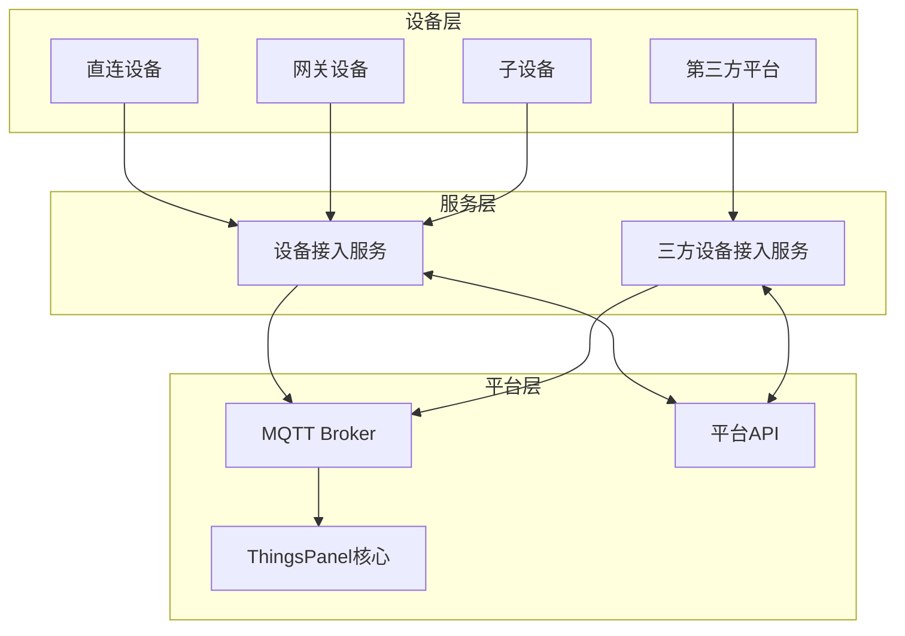
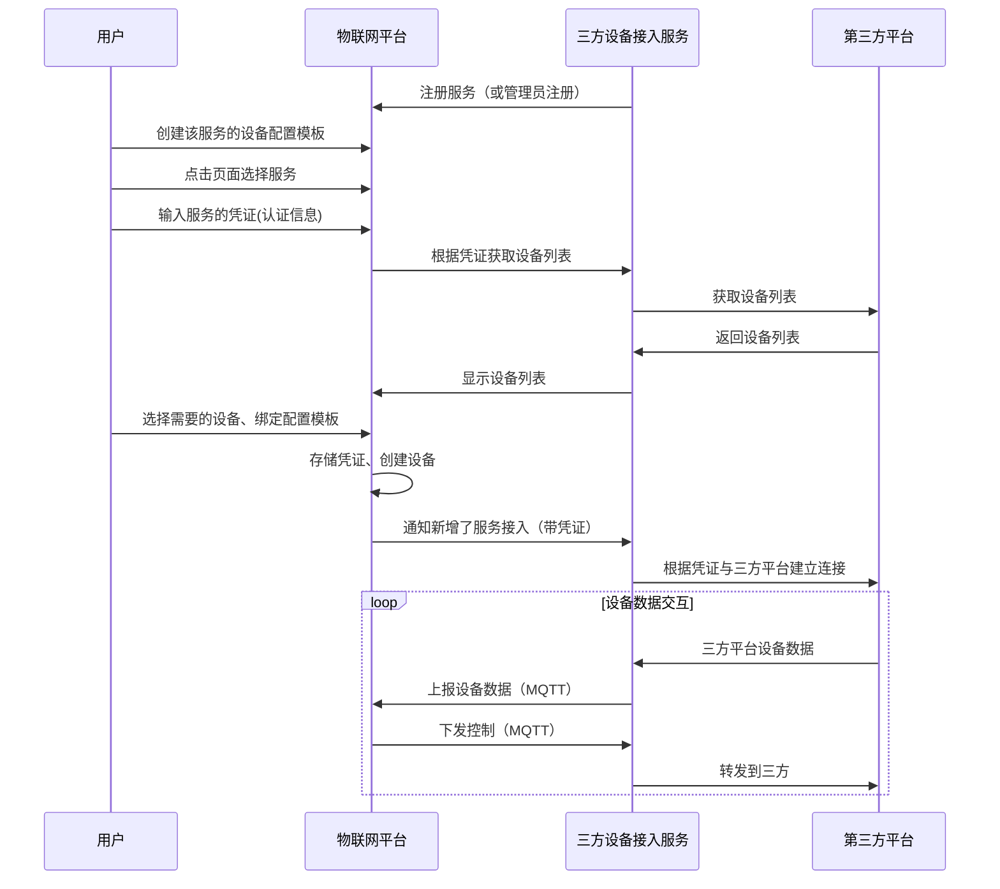
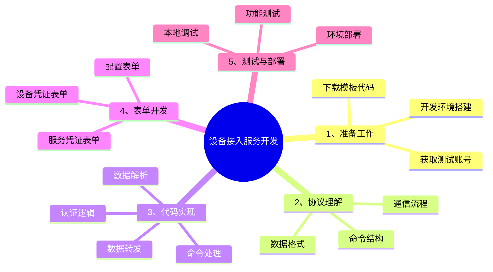

# 设备接入服务开发指南

## 概述

### 背景与问题

在物联网领域，通信协议极为多样且复杂。常见的协议包括MQTT、TCP、HTTP、SOAP、Modbus、OPC-UA、Bacnet、KNX、LwM2M和SNMP等，还有数不清的其他协议以及各种各样的网关服务或三方服务。

:::warning 现状与挑战
- **复杂性**：这些协议和服务在通信模式和报文规范上各不相同，导致在系统集成时面临巨大的复杂性
- **后果**：这种复杂性不仅使系统变得臃肿、效率低下，而且还难以扩展和维护，进而导致维护成本居高不下
:::

### 服务定义

设备接入服务是一个多功能中间件组件，作为设备与系统之间的桥梁，将设备接入ThingsPanel平台，实现设备与平台的交互。

### 服务类别

:::info 两大核心类别
1. **设备接入服务**：支持各种物联网协议（如MODBUS、MQTT等），使ThingsPanel平台能够**直接**与使用这些协议的设备通信
2. **三方设备接入服务**：连接ThingsPanel平台与各种第三方物联网平台，**间接**与设备通信，实现数据互通和设备管理
:::

### 主要功能

- 🔗 提供统一的接口规范，简化设备和第三方平台的接入流程
- 🌐 支持多种协议和服务，增强ThingsPanel平台的兼容性和扩展性
- ⚙️ 实现灵活的配置和凭证管理，方便用户快速接入不同的协议和第三方平台
- 📊 实时数据同步和设备状态监控
- 🔧 模块化设计，易于扩展支持新的协议和第三方平台

### 交互结构图 


### 架构图



## 设备接入服务交互流程



## 开发指南

### 准备工作



### 开发步骤

#### 1. 下载设备接入服务模板

```bash
git clone https://gitee.com/ThingsPanel/protocol-plugin-template.git
```

#### 2. 理解核心概念

:::info 四大核心数据类型
理解ThingsPanel的四种数据模型对于设备接入服务开发至关重要：

- **🔄 遥测（Telemetry）** - 设备实时上报的数据，通常是随时间变化的测量值
- **📋 属性（Attributes）** - 设备的静态或较少变化的特征信息
- **🎯 事件（Events）** - 设备中发生的特定事件或状态变化
- **⚡ 命令（Commands）** - 平台发送到设备的控制指令
:::

#### 3. 修改模板代码

- 阅读模板源码的README-DEV.md
- 更新SDK到最新版本：
  ```bash
  go get -u github.com/ThingsPanel/tp-protocol-sdk-go@latest
  ```
- 根据协议文档修改凭证表单 `from_voucher.json`
- 判断是否需要配置表单
- 修改 `http_service/service.go` 中的接口实现

#### 4. 注册设备接入服务

使用超管账户在平台注册设备接入服务：
- **应用管理** → **设备接入服务管理** → **添加新服务**

#### 5. 编写核心流程

- 处理设备消息的上下行报文
- 使用AI工具辅助生成协议解析代码
- 通过MQTT客户端与平台交互数据

#### 6. 集成测试

- 创建设备模板并选择协议
- 创建设备并绑定模板
- 填写设备凭证信息
- 连接设备到设备接入服务进行测试

## 技术规范

参考接口文档：[ThingsPanel API文档](https://docs.thingspanel.io/zh/developer-guide/api-reference/index.html)

目录：
- ✨设备接入服务-平台提供
- ✨设备接入服务-服务提供

## 数据交互规范

### 设备接入服务推送数据到平台

#### 直连设备/子设备消息/网关设备消息

- **MQTT用户**：plugin
- **发布主题**：`device/telemetry`
- **报文格式**：
  ```json
  {"device_id":"device_id","values":{"key":"value"}}
  ```


#### 在线离线通知

- **发布主题**：`device/status`
- **报文格式**：
  ```json
  {"device_id":"device_id","values":1}
  ```
  其中：0-离线，1-上线

### 平台推送数据给设备接入服务

#### 订阅主题规范

设备接入服务需要订阅带有前缀的主题：

- **订阅主题**：`plugin/{service_identifier}/#`
- **主题说明**：`plugin/{service_identifier}/` 为注册设备接入服务时填写的订阅主题前缀，`#`部分遵循[MQTT设备接入规范](../../device-connect/mqtt-device-rule.md)

:::note 主题映射
设备接入服务的订阅主题比平台下行规范多了主题前缀，其中`device_number`需要改为`device_id`
:::

## 设备接入服务注册

### 注册参数

| 参数 | 说明 |
|------|------|
| 服务名称 | 创建设备模板时，会显示在选择协议下拉框中 |
| 服务标识符 | 系统中唯一标识这个设备接入服务，由字母和数字组成 |
| 类别 | 选择接入协议 |
| HTTP服务地址 | 填写平台后端能够直接访问设备接入服务API的地址，格式如127.0.0.1:8151 |
| 服务订阅主题前缀 | 格式如`service/{name}/` |
| 设备接入地址 | 显示在设备凭证管理的下发，提示用户设备连接地址 |

### 注册方式

#### 平台注册

1. 使用超管账号登录
2. 进入 **应用管理** → **设备接入服务管理**
3. 点击 **添加新服务** 按钮
4. 填写相关配置信息

## 参考资源

:::tip 开发资源
- [MQTT网关设备接入规范](../../device-connect/mqtt-gateway-rule.md)
- [MQTT直连设备接入规范](../../device-connect/mqtt-device-rule.md)
- [Modbus设备接入服务示例](https://github.com/ThingsPanel/modbus-protocol-plugin)
- [GB26875.3-2011设备接入服务示例](https://gitee.com/ThingsPanel/protocol-plugin-pressure-transmitter)
:::

## 最佳实践

:::warning 开发注意事项
1. **消息ID管理**：建议使用时间戳后7位，确保短期内不重复
2. **设备唯一性**：确保设备编号在系统中全局唯一
3. **错误处理**：实现完整的错误响应机制，便于问题诊断
4. **性能优化**：推荐在设备接入服务内解析数据，避免使用脚本转换
5. **表单验证**：上报前验证JSON格式的正确性
6. **设备状态管理**：实现设备状态管理，包括在线、离线。
:::


