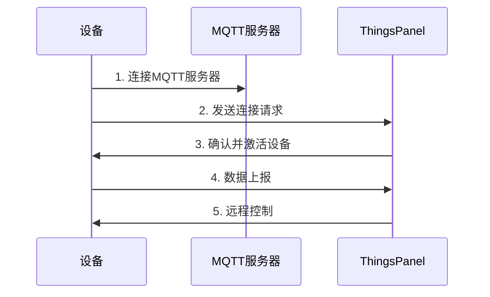

# 网关设备MQTT数据交互规范

## 概述

本规范描述通过MQTT协议连接到ThingsPanel的网关设备接入要求，定义了设备与平台之间的数据交互格式和流程。

:::info 重要说明
- **message_id** 为消息标识符，近期消息不重复即可，可取毫秒时间戳的后七位（仅为建议，实际不限制长度）
- **device_number** 为设备编号，设备唯一标识，平台可修改
- **sub_device_address** 为子设备地址，网关下唯一，平台可修改
- 核心交互数据分为四类：**遥测、属性、事件、命令**
:::

:::note 灵活性说明
- **订阅和发布** - 设备对于主题的订阅和发布都是可选的，可根据实际需求选择
- **响应机制** - 设备响应也是可选的，可根据业务场景决定是否实现
- **报文格式** - 非规范的报文也支持，可通过平台脚本转换为规范格式
:::

## 设备要求

设备需具备以下特性：

- ✅ MQTT客户端能力
- ✅ 可联网并稳定运行

## 接入步骤



1. **注册设备** - 在ThingsPanel创建设备并获取配置
2. **建立连接** - 设备连接到MQTT服务器
3. **发送请求** - 设备发送连接请求消息
4. **激活确认** - ThingsPanel确认并激活设备
5. **数据交互** - 设备上报数据，接收平台控制

## MQTT主题规范

### 设备上报主题（平台订阅）

| 主题 | 说明 | 数据类型 | 是否必需 |
|------|------|----------|----------|
| `gateway/telemetry` | 上报遥测数据 | 遥测 | 可选 |
| `gateway/attributes/{message_id}` | 上报属性状态 | 属性 | 可选 |
| `gateway/event/{message_id}` | 上报事件信息 | 事件 | 可选 |
| `gateway/command/response/{message_id}` | 命令执行响应 | 响应 | 可选 |
| `gateway/attributes/set/response/{message_id}` | 属性设置响应 | 响应 | 可选 |

### 设备订阅主题（平台下发）

:::note 主题说明
**注意：** `+` 表示 `message_id` 占位符，长度不限制
:::

| 主题 | 说明 | 数据类型 | 是否必需 |
|------|------|----------|----------|
| `gateway/telemetry/control/{device_number}` | 接收遥测控制指令 | 控制 | 可选 |
| `gateway/attributes/set/{device_number}/+` | 接收属性设置指令 | 属性设置 | 可选 |
| `gateway/attributes/get/{device_number}` | 接收属性查询请求 | 属性查询 | 可选 |
| `gateway/command/{device_number}/+` | 接收命令执行请求 | 命令 | 可选 |
| `gateway/attributes/response/{device_number}/+` | 接收属性响应确认 | 响应确认 | 可选 |
| `gateway/event/response/{device_number}/+` | 接收事件响应确认 | 响应确认 | 可选 |

## 数据交互格式

### 1. 遥测数据上报

**主题：** `gateway/telemetry`

```json title="遥测数据格式示例"
{
    "gateway_data": {
        "temperature": 28.5,
        "version": "v0.1",
        "switch": true
    },
    "sub_device_data": {
        "28da4985": {
            "temperature": 28.5,
            "version": "v0.1",
            "switch": true
        },
        "sub_device_address2": {
            "temperature": 28.5,
            "version": "v0.1",
            "switch": true
        }
    }
}
```

### 2. 属性数据上报

**主题：** `gateway/attributes/{message_id}`

```json title="属性数据格式示例"
{
    "gateway_data": {
        "ip": "127.0.0.1",
        "version": "v0.1"
    },
    "sub_device_data": {
        "sub_device_address1": {
            "ip": "127.0.0.1",
            "version": "v0.1"
        },
        "sub_device_address2": {
            "ip": "127.0.0.1",
            "version": "v0.1"
        }
    }
}
```

### 3. 事件数据上报

**主题：** `gateway/event/{message_id}`

```json title="事件数据格式示例"
{
    "gateway_data": {
        "method": "FindAnimal",
        "params": {
            "count": 2,
            "animalType": "cat"
        }
    },
    "sub_device_data": {
        "sub_device_address1": {
            "method": "FindAnimal",
            "params": {
                "count": 2,
                "animalType": "cat"
            }
        },
        "sub_device_address2": {
            "method": "FindAnimal",
            "params": {
                "count": 2,
                "animalType": "cat"
            }
        }
    }
}
```

### 4. 接收控制指令

**主题：** `gateway/telemetry/control/{device_number}`

```json title="控制指令格式示例"
{
    "gateway_data": {
        "temperature": 28.5,
        "version": "v0.1",
        "switch": true
    },
    "sub_device_data": {
        "sub_device_address1": {
            "temperature": 28.5,
            "version": "v0.1",
            "switch": true
        },
        "sub_device_address2": {
            "temperature": 28.5,
            "version": "v0.1",
            "switch": true
        }
    }
}
```

### 5. 接收属性设置

**主题：** `gateway/attributes/set/{device_number}/+`

```json title="属性设置格式示例"
{
    "gateway_data": {
        "ip": "127.0.0.1",
        "version": "v0.1"
    },
    "sub_device_data": {
        "sub_device_address1": {
            "ip": "127.0.0.1",
            "version": "v0.1"
        },
        "sub_device_address2": {
            "ip": "127.0.0.1",
            "version": "v0.1"
        }
    }
}
```

### 6. 接收属性查询请求

**主题：** `gateway/attributes/get/{device_number}`

**请求所有属性：**
```json title="查询所有属性"
{
    "gateway_data": []
}
```

**请求指定属性：**
```json title="查询指定属性"
{
    "gateway_data": [],
    "sub_device_data": {
        "sub_device_address1": ["temp", "hum"],
        "sub_device_address2": ["temp", "hum"]
    }
}
```

### 7. 接收命令执行请求

**主题：** `gateway/command/{device_number}/+`

```json title="命令执行格式示例"
{
    "gateway_data": {
        "method": "FindAnimal",
        "params": {
            "count": 2,
            "animalType": "cat"
        }
    },
    "sub_device_data": {
        "sub_device_address1": {
            "method": "FindAnimal",
            "params": {
                "count": 2,
                "animalType": "cat"
            }
        },
        "sub_device_address2": {
            "method": "FindAnimal",
            "params": {
                "count": 2,
                "animalType": "cat"
            }
        }
    }
}
```

## 响应格式规范

### 响应参数说明

| 参数 | 是否必输 | 类型 | 说明 |
|------|----------|------|------|
| `result` | ✅ | number | 执行结果：`0`-成功，`1`-失败 |
| `errcode` | ❌ | string | 错误码（失败时提供） |
| `message` | ✅ | string | 响应消息内容 |
| `ts` | ❌ | number | 时间戳（秒） |
| `method` | ❌ | string | 事件和命令的方法名 |

### 响应格式示例

**成功响应：**
```json title="操作成功"
{
  "result": 0,
  "message": "success",
  "ts": 1609143039
}
```

**失败响应：**
```json title="操作失败"
{
  "result": 1,
  "errcode": "INVALID_PARAM",
  "message": "Invalid parameter value",
  "ts": 1609143039,
  "method": "ReSet"
}
```

**带方法的成功响应：**
```json title="命令执行成功"
{
  "result": 0,
  "message": "Command executed successfully",
  "ts": 1609143039,
  "method": "ReSet"
}
```

## 脚本转换支持

:::tip 自定义格式支持
平台支持非规范格式的报文，可以通过以下方式处理：

1. **脚本转换** - 在平台配置脚本，将自定义格式转换为规范格式
2. **灵活接入** - 设备可以使用现有的数据格式，无需强制修改
3. **数据映射** - 通过脚本实现字段映射和数据转换
4. **兼容性** - 保持设备原有协议的同时，满足平台数据规范要求
:::

## 最佳实践

:::tip 开发建议
1. **消息ID管理** - 建议使用时间戳后7位，但长度不限制，确保消息ID在近期不重复即可
2. **可选实现** - 根据实际业务需求选择订阅、发布和响应的实现
3. **数据验证** - 上报前验证JSON格式的正确性
4. **连接保持** - 实现MQTT心跳机制保持连接稳定
5. **重连机制** - 网络异常时自动重连
6. **脚本利用** - 对于现有设备，可利用平台脚本功能实现格式转换
:::

:::warning 注意事项
- 确保设备编号在系统中唯一
- 遥测数据建议定期上报，避免数据丢失
- 如实现响应机制，命令执行后建议返回响应确认
- 属性设置时建议验证参数有效性
- 非规范报文虽然支持，但建议优先使用规范格式以获得更好的性能
:::
