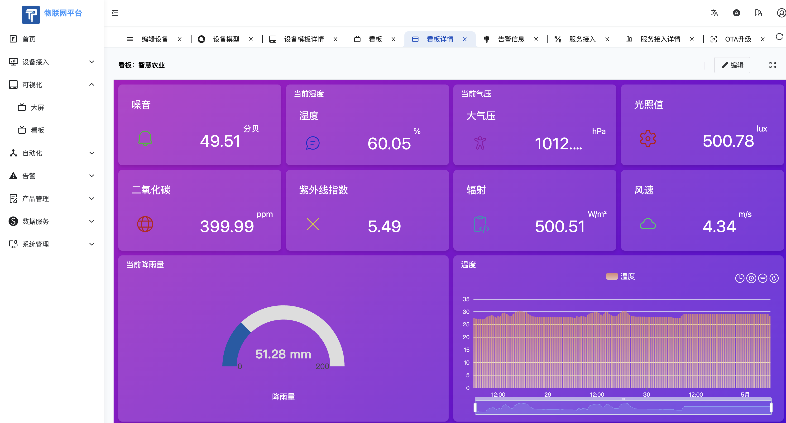
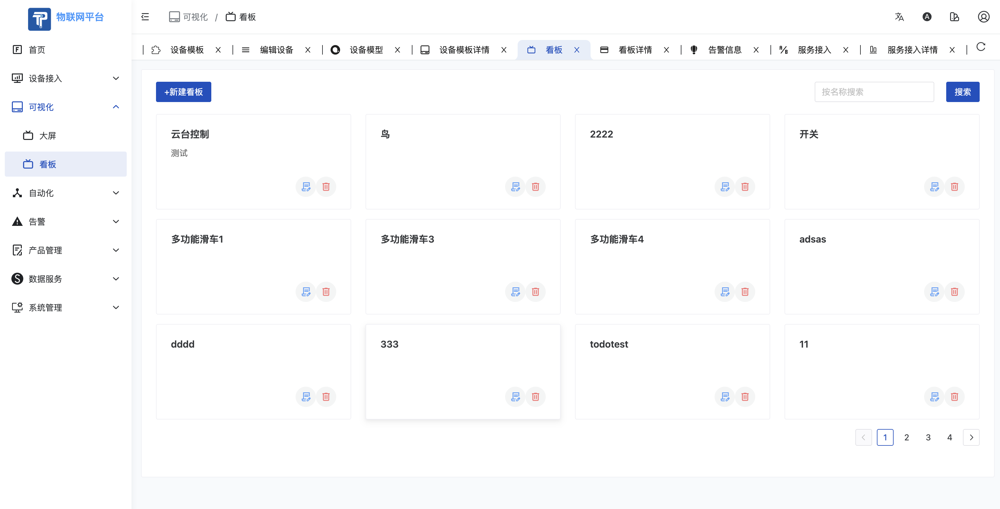

# 看板

- 点击可视化-看板进入看板管理页面，此部分功能同系统管理员看板功能。
- 组件因为权限不同而不同
- 系统标签支持的组件有：
  - 设备总数
  - 设备在线数
  - 设备离线数
  - 设备在线率
  - 设备离线率
  - 设备在线趋势
  - 操作指引
  - 最近访问
  - 最新上报数据
  - 系统指标历史
  - 月用户增长统计
  - 租户数量
  - 版本信息
  - CPU使用率
  - 内存使用率
  - 磁盘使用率
  - App下载
  - 告警信息
  - 告警统计
- 图表标签支持的卡片有
  - 数字指示器
  - 柱状图
  - 折线图
  - 数值控制
  - 数据下发
  - 枚举控制
  - 仪表盘
  - 状态卡片
  - 设备开关控制
  - 表格
  - 播放器
  - 文字信息
- 设备标签
  - 支持直接通过选择设备绑定的图表，拖拽即可，非常方便
# 看板查看

# 看板编辑

# 看板列表

